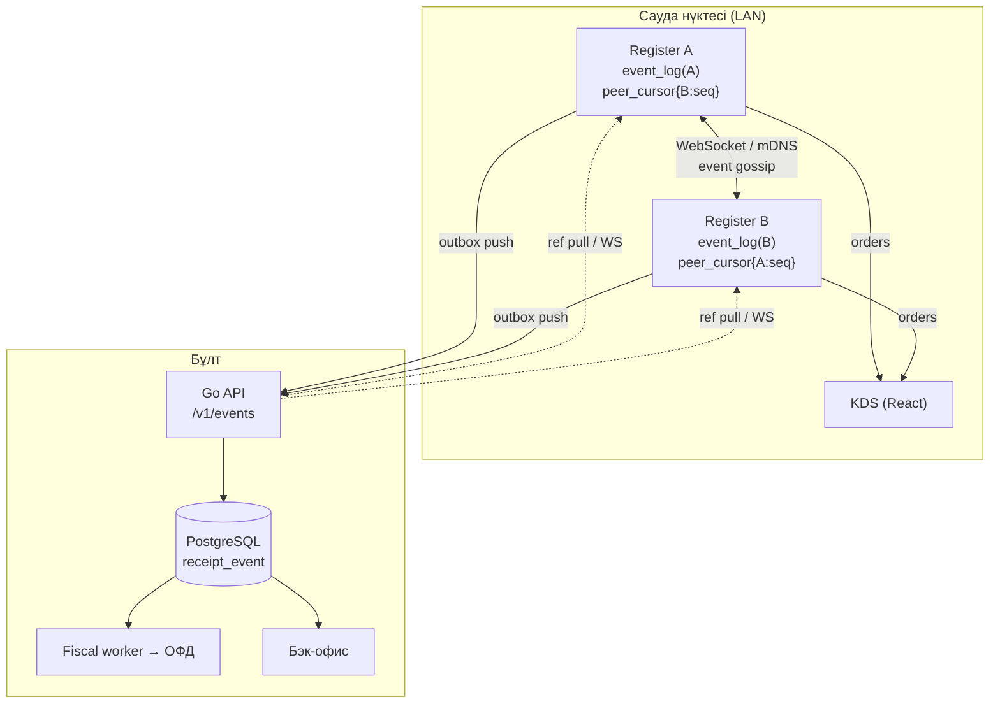

# 05 — Offline-first архитектура

> Зерттеу күні: **2026-09-01**. Автор: research subagent (Kassa жобасы, Фаза 1).
> Бұл құжат — **шешім емес, материал**. Соңғы таңдауды жоба иесі қабылдайды.

---

## 0. Әдістеме және шектеулер

### 0.1 Таңбалау

| Таңба | Мағынасы |
|---|---|
| `[РАСТАЛҒАН]` | Ресми құжаттама, нақты бастапқы код файлы немесе академиялық жұмыс. URL + файл жолы + функция аты берілген. |
| `[ЖАНАМА]` | Блог, форум, конференция, StackOverflow, іздеу индексінің үзіндісі. |
| `[БОЛЖАМ]` | Менің инженерлік қорытындым. Дереккөз жоқ. |
| `[БҰҒАТТАЛҒАН]` | Тексеру үшін нақты өлшеу, прототип немесе қолжетімсіз құжаттама керек. |

### 0.2 Ортаның желілік саясаты (нақты өлшенген)

**Толық ашық:** `github.com`, `raw.githubusercontent.com`, `gist.github.com`,
`objects.githubusercontent.com`, `pub.dev`, npm/PyPI/crates/Go proxy.
`api.github.com` — **жабық** (сессия өз репозиторийімен шектелген), сондықтан
каталогты қарау `github.com/<owner>/<repo>/tree/...` бетін WebFetch арқылы оқу
жолымен жасалды.

**Бұғатталған (proxy 403, ұйым саясаты):** `sqlite.org`, `rfc-editor.org`,
`arxiv.org`, `cse.buffalo.edu`, `learn.microsoft.com`, `docs.aws.amazon.com`,
`microservices.io`, `brandur.org`, `en.wikipedia.org`, `martinfowler.com`,
`jepsen.io`, `crdt.tech`, `automerge.org`, `docs.yjs.dev`, `api.dart.dev`,
`docs.flutter.dev`, `drift.simonbinder.eu`, `electric-sql.com`,
`docs.powersync.com`, `rxdb.info`, `watermelondb.dev`, `turso.tech`,
`docs.couchdb.org`, `odoo.com`, `medium.com`, `stackoverflow.com`, `*.github.io`.

Сонымен қатар WebSearch бюджеті сессияда таусылды (200/200).

**Стратегия:** құжаттама сайты бұғатталса, сол құжаттаманың **markdown көзі
репозиторийден** оқылды. Бұл көп жағдайда сәтті болды — төмендегі кестені
қараңыз.

### 0.3 Не шынымен оқылды (код/құжат) vs не тек сниппеттен белгілі

| Дереккөз | Қалай алынды | Мәртебе |
|---|---|---|
| Odoo 18 `point_of_sale` (`pos_order.py`, `pos_session.py`, `pos_config.py`, `pos_bus_mixin.py`, `data_service.js`, `pos_store.js`) | **толық файл** raw.githubusercontent | `[РАСТАЛҒАН]` |
| WatermelonDB `src/sync/*` **+ ресми docs** `docs-website/docs/docs/Sync/*`, `Implementation/SyncImpl.md` | **толық файл** | `[РАСТАЛҒАН]` |
| ElectricSQL `website/docs/sync/guides/writes.md` + `examples/write-patterns/**` (SQL + TS коды) | **толық файл** | `[РАСТАЛҒАН]` |
| PowerSync ресми docs (`architecture/*`, `handling-writes/*`) | **толық файл** | `[РАСТАЛҒАН]` |
| RxDB `docs-src/docs/replication.md` | **толық файл** | `[РАСТАЛҒАН]` |
| CouchDB `src/docs/src/replication/protocol.rst` (1898 жол) | **толық файл** | `[РАСТАЛҒАН]` |
| Turso `turso-docs` (`sync/conflict-resolution`, `sync/checkpoint`, `sync/usage`) | **толық файл** | `[РАСТАЛҒАН]` |
| Litestream `README.md` | **толық файл** | `[РАСТАЛҒАН]` |
| CockroachDB `pkg/util/hlc/hlc.go` | **толық файл** | `[РАСТАЛҒАН]` |
| Floreant POS домен модельдері (Java) | **толық файл** | `[РАСТАЛҒАН]` |
| ERPNext `pos_opening_entry.py/.json`, `pos_closing_entry.py`, `point_of_sale.py` | **толық файл** | `[РАСТАЛҒАН]` |
| Yjs / Automerge / NexoPOS / Electric README | **толық файл** | `[РАСТАЛҒАН]` |
| Dart SDK `stopwatch.dart` | **толық файл** | `[РАСТАЛҒАН]` |
| drift / drift_flutter (pub.dev беті + GitHub талқылауы #3249) | ресми бет + мейнтейнер жауабы | `[РАСТАЛҒАН]` |
| Android WorkManager | ресми бет | `[РАСТАЛҒАН]` |
| **SQLite WAL / `PRAGMA synchronous`** | тек іздеу сниппеті (домен бұғатталды) | `[ЖАНАМА]` |
| **RFC 9562 (UUIDv7)** | тек іздеу сниппеті | `[ЖАНАМА]` |
| **HLC түпнұсқа мақаласы** | оқылмады; орнына CockroachDB **коды** оқылды | `[ЖАНАМА]`/`[РАСТАЛҒАН]` |
| **D365 shared shift** | тек іздеу сниппеті | `[ЖАНАМА]` |
| **Stripe idempotency keys** | тек іздеу сниппеті | `[ЖАНАМА]` |
| **uniCenta / Openbravo / Chromis** | тек форум сниппеті (GitHub-та ресми репо табылмады) | `[ЖАНАМА]` |
| **Kaspi QR / ҚР ОФД** | зерттелмеді (басқа агенттің тақырыбы) | — |

---

## 1. Синхрондау стратегияларының салыстыруы

### 1.1 Outbox + monotonic sequence + server ack

**Мәні.** Жергілікті БД-да бизнес-жазба мен «шығыс кезек» жазбасы **бір
транзакцияда** жасалады. Фондық жіберуші кезекті ретімен оқып, серверге
жібереді, ack алғанда ғана өшіреді.

PowerSync дәл осы модельді өнеркәсіптік деңгейде іске асырған:

> «Client mutations are recorded as PUT, PATCH, or DELETE operations and
> persisted in a **blocking FIFO queue**… the client does not advance to a new
> checkpoint [while mutations remain unacknowledged]»
> `[РАСТАЛҒАН]` https://raw.githubusercontent.com/powersync-ja/powersync-docs/main/architecture/consistency.mdx

Клиенттік API-де бұл `CrudBatch`/`complete()` түрінде көрінеді: `complete()` —
«remove the changes from the local queue, once successfully uploaded»
`[РАСТАЛҒАН]` https://pub.dev/documentation/powersync/latest/powersync/CrudBatch-class.html

**POS контексіндегі артықшылығы:**
- Реттілік табиғи түрде сақталады → **ОФД-ға чектерді ретімен жіберу заң талабы
  дәл осы модельге сәйкес келеді** `[БОЛЖАМ]`.
- Дедупликация оңай: `(device_id, seq)` бойынша unique index.
- Дебаг оңай: кезек — қарапайым кесте, оны көзбен оқуға болады.

**Кемшілігі:**
- FIFO кезек **бұғатталады**. PowerSync мұны ашық ескертеді: 4xx қатесі кезекті
  тоқтатады, «Unresolved constraint violations can block the upload queue
  indefinitely»
  `[РАСТАЛҒАН]` https://raw.githubusercontent.com/powersync-ja/powersync-docs/main/handling-writes/writing-client-changes.mdx
  → бір «улы» чек бүкіл ауысымның синхрондауын тоқтатады.
- Бір касса екінші кассаның деректерін тікелей көрмейді (тек сервер арқылы).

**Қашан жарамды:** чек, төлем, ауысым оқиғалары — яғни **өзгермейтін
фактілер** `[БОЛЖАМ]`.

### 1.2 CRDT (Automerge, Yjs, RGA/LWW-register, δ-CRDT)

**Мәні.** Деректер құрылымы кез келген ретпен қосылғанда бірдей нәтиже
беретіндей етіп жобаланады (commutative, associative, idempotent merge).

**Ең маңызды факт — құжат тек өседі.** Yjs ресми README:

> «CRDTs that are suitable for shared text editing suffer from the fact that
> they **only grow in size**. There are CRDTs that do not grow in size, but they
> do not have the characteristics that are beneficial for shared text editing…
> **We can't garbage collect deleted structs (tombstones)** while ensuring a
> unique order of the structs.»
> `[РАСТАЛҒАН]` https://raw.githubusercontent.com/yjs/yjs/main/README.md

Automerge өз кезегінде «a compact compression format for these CRDTs» ұсынады
және «achieved around a 10x reduction in memory usage» дейді
`[РАСТАЛҒАН]` https://raw.githubusercontent.com/automerge/automerge/main/README.md
— бірақ бұл **абсолюттік өлшем емес, өзінің бұрынғы нұсқасымен салыстыру**.

Тіпті PowerSync өз құжаттамасында CRDT-ді тек **бірлескен редакциялау** үшін
ұсынады: «For collaborative applications requiring automatic merging, …
CRDT data structures like Yjs … can be stored and synced using PowerSync»
`[РАСТАЛҒАН]` https://raw.githubusercontent.com/powersync-ja/powersync-docs/main/handling-writes/handling-update-conflicts.mdx

**POS контексінде CRDT артық** `[БОЛЖАМ]`, себебі:

1. Чекте **бірлескен редакциялау жоқ**. Екі кассир бір чекті бір мезгілде
   өңдемейді. Ал CRDT-нің бүкіл құны — дәл сол сценарий үшін.
2. CRDT «қақтығысты автоматты шешеді» — фискалдық есепте бұл **қауіп**, пайда
   емес. Заң «автоматты біріктірілген» чекті емес, нақты бір фактіні талап
   етеді `[БОЛЖАМ]`.
3. Tombstone өсуі касса құрылғысында (SUNMI, арзан Android) жылдар бойы
   жиналады. Нақты өсу қарқыны өлшенбеген → `[БҰҒАТТАЛҒАН]`.
4. Ақша — integer тиын. CRDT counter (PN-Counter) ақшаны дұрыс модельдей алады,
   бірақ **чек сомасы counter емес, өзгермейтін факт**.

**Қайшы көзқарас (адал көрсету керек).** CRDT бір нақты жерде пайдалы болуы
мүмкін: **ортақ ашық чек (open table / жүгіртпе шот)** бірнеше касса арасында
LAN арқылы. Егер екі даяшы бір үстелдің чегіне бір мезгілде позиция қосса,
LWW-Set немесе OR-Set дұрыс жауап береді, ал «соңғы жазу жеңеді» позицияны
жоғалтады `[БОЛЖАМ]`. Odoo дәл осы жерде сүрінген (§5.1.4 қараңыз).

**δ-CRDT** толық күйдің орнына дельта жібереді → трафик азаяды, бірақ
tombstone мәселесі қалады `[БОЛЖАМ]`.

### 1.3 Last-write-wins / vector clock / version vectors

**LWW.** Ең қарапайым: әр жазбаның `updated_at` (немесе HLC) бар, үлкені
жеңеді. PowerSync-тің үнсіз келісім бойынша мінезі — **өріс деңгейіндегі LWW**:

> «the last update (as received by the server) to each individual field wins…
> If one client deletes a row, any future updates to that row are ignored.»
> `[РАСТАЛҒАН]` https://raw.githubusercontent.com/powersync-ja/powersync-docs/main/handling-writes/handling-update-conflicts.mdx

Назар аударыңыз: **«as received by the server»** — клиент сағаты емес, сервердің
қабылдау реті. Бұл clock skew мәселесін айналып өтудің практикалық тәсілі.

RxDB де сол қағиданы ұстанады: «The default conflict handler will always drop
the fork state and use the master state» — яғни **сервер жеңеді**
`[РАСТАЛҒАН]` https://raw.githubusercontent.com/pubkey/rxdb/master/docs-src/docs/replication.md

Turso (libSQL мұрагері) **last push wins** таңдаған:

> «Turso sync uses a **last push wins** strategy. When two clients modify the
> same data and push, the last push determines the final state on the remote.»
> `[РАСТАЛҒАН]` https://raw.githubusercontent.com/tursodatabase/turso-docs/main/sync/conflict-resolution.mdx

WatermelonDB **бағана деңгейіндегі client-wins** таңдаған. Нақты код:

```js
// src/sync/impl/helpers.js
export function resolveConflict(local: RawRecord, remote: DirtyRaw): DirtyRaw {
  if (local._status === 'deleted') { return local }
  const resolved = { ...local, ...remote, id: local.id,
                     _status: local._status, _changed: local._changed }
  // Use local properties where changed
  local._changed.split(',').forEach((column) => { resolved[column] = local[column] })
  return resolved
}
```
`[РАСТАЛҒАН]` https://raw.githubusercontent.com/Nozbe/WatermelonDB/master/src/sync/impl/helpers.js

**Vector clock / version vector.** Қақтығысты **анықтайды** (шеше алмайды):
екі нұсқа concurrent па, әлде біреуі екіншісінен туындады ма — соны айтады.
Өлшемі қатысушы санына пропорционал өседі. 1–3 кассада бұл 3 санақ — арзан.
Бірақ **қатысушы жиыны өзгермелі** (жаңа құрылғы қосылды, ескісі сынды) →
vector clock тазалау (pruning) қажет, ол қиын `[БОЛЖАМ]`.

**Кестелік қорытынды:**

| Тәсіл | Қақтығысты анықтайды | Шешеді | Өлшемі | POS-та қайда |
|---|---|---|---|---|
| LWW (wall clock) | жоқ | иә (жалған) | O(1) | ешқайда — сағат сенімсіз |
| LWW (last push wins, Turso) | жоқ | иә | O(1) | ешқайда — чек жоғалады |
| LWW (server receive order) | жоқ | иә | O(1) | анықтамалық (тауар, баға) |
| Version vector | иә | жоқ | O(N құрылғы) | ортақ ашық чек (LAN) |
| HLC | ішінара | иә | O(1) | оқиға реті, UI сұрыптау |
| Append-only log | қақтығыс жоқ | — | O(оқиға) | чек, төлем, ауысым |

### 1.4 Event sourcing + append-only log

**Мәні.** Күй сақталмайды — оқиғалар сақталады, күй solar projection ретінде
есептеледі. Чек ешқашан `UPDATE` жасалмайды.

Бұл жобаның CLAUDE.md-де бекітілген принципі, және фискалдық аудит үшін
логикалық таңдау: аудитор «чек қалай өзгерді?» деп сұрағанда, оқиға тізбегі —
жауап `[БОЛЖАМ]`.

**Артықшылығы:**
- Қақтығыс ұғымы **жойылады**: екі құрылғы әртүрлі оқиға жазады, екеуі де
  журналға түседі. Біріктіру керек емес.
- Идемпотенттілік табиғи: `event_id` бойынша `INSERT … ON CONFLICT DO NOTHING`.
- Офлайн ұзақ болса — журнал өседі, бірақ **сызықты** (CRDT метадеректері
  сияқты квадраттық емес) `[БОЛЖАМ]`.

**Кемшілігі:**
- Оқу үшін projection керек → жергілікті БД-да чектің «ағымдағы күйі» кестесі
  де болуы керек (denormalized read model). Бұл — қосымша код және қосымша
  тест `[БОЛЖАМ]`.
- Оқиға схемасының версиялануы (event versioning) — миграция кезінде ескі
  оқиғаларды оқи білу керек `[БОЛЖАМ]`.
- **Ең маңыздысы:** ешбір танымал sync кітапханасы (WatermelonDB, RxDB,
  PowerSync, Electric) event log-ты бірінші класты нысан ретінде қолдамайды.
  Олардың бәрі **жол күйін** (row state) синхрондайды. Демек, event sourcing
  таңдалса — **sync engine өз қолымызбен жазылады** `[БОЛЖАМ]`.

Мұны WatermelonDB коды нақты дәлелдейді: push фазасы `created/updated/deleted`
жиынын жібереді, яғни **соңғы күйді**, оқиға тізбегін емес:

```js
export type SyncTableChangeSet = $Exact<{
  created: DirtyRaw[], updated: DirtyRaw[], deleted: RecordId[],
}>
```
`[РАСТАЛҒАН]` https://raw.githubusercontent.com/Nozbe/WatermelonDB/master/src/sync/index.js

### 1.5 Гибрид (ұсынылатын бағыт)

**Деректерді екі класқа бөлу:**

| Класс | Мысал | Авторитет | Модель | Қақтығыс |
|---|---|---|---|---|
| **Fact** (факт) | чек, төлем, қайтару, ауысым ашу/жабу, инкассация, маркировка коды | **касса** | append-only event log | болмайды |
| **Reference** (анықтамалық) | тауар, баға, техкарта, модификатор, рөл, қызметкер | **сервер** | версияланған snapshot + LWW | серверде шешіледі |
| **Aggregate** (жинақ) | қалдық, ABC-есеп | **сервер** | projection | есептеледі |
| **Shared mutable** (ортақ өзгермелі) | ашық чек/үстел бірнеше кассада | ??? | §4 қараңыз | ең қиын жер |

Бұл бөлу «offline-first» деген сөзді нақтылайды: **касса офлайнда факт жаза
алады, бірақ анықтамалықты өзгерте алмайды**. Кассирдің бағаны офлайнда
өзгертуі — бизнес талабы емес, ол бэк-офистің ісі `[БОЛЖАМ]`.

Дәл осындай бөлуді Electric ашық жариялайды — ол **тек оқу жолын** синхрондайды:

> «Specifically, Electric is a **read-path sync engine** for Postgres. It syncs
> data out of Postgres into … anything you like.»
> `[РАСТАЛҒАН]` https://raw.githubusercontent.com/electric-sql/electric/main/README.md

Яғни жазу жолы (POST /orders) бәрібір өз API-мыз болады.

### 1.6 Офлайн ұзақ болса не болады (72 сағат)

| Стратегия | 72 сағ офлайннан кейін |
|---|---|
| Outbox + seq | Кезекте N чек. Жіберу — сызықты. Ретсіздік жоқ. **Ең болжамды.** |
| CRDT | Құжат tombstone-мен өскен. Merge — CPU-ға ауыр, бірақ жұмыс істейді. |
| LWW (wall clock) | **Қауіпті**: 72 сағ бұрынғы клиенттің «жаңа» timestamp-ы сервердегі жаңа деректі басып тастауы мүмкін. |
| Event log | Журналда N оқиға. Жіберу — сызықты. Күй қайта есептеледі. |
| WatermelonDB моделі | `lastPulledAt` 72 сағ ескі → сервер осы уақыттан кейінгі **барлық** өзгерісті қайтаруы керек; tombstone кестесі болмаса, өшірілгендер жоғалады `[БОЛЖАМ]`. |

**Деректер көлемінің өсуі** `[БОЛЖАМ]` (өлшенбеген — `[БҰҒАТТАЛҒАН]`):
- Outbox/event log: O(операция саны). Ауысымда 300 чек × ~5 оқиға = 1500 жол.
- CRDT: O(барлық операция тарихы) + tombstone, ешқашан толық тазаланбайды.
- LWW: O(жол саны) — тұрақты, бірақ тарих жоқ.

Нақты өлшем үшін прототип керек → `[БҰҒАТТАЛҒАН]`.

---

## 2. Идемпотенттілік және дедупликация

### 2.1 UUIDv4 vs UUIDv7

`[ЖАНАМА]` (RFC 9562 түпнұсқасы бұғатталды, іздеу индексі арқылы):
RFC 9562 (2024 ж. мамыр) UUIDv6/v7/v8 нұсқаларын енгізді. UUIDv7 = 48 бит Unix
ms timestamp жоғарғы биттерде + 12 бит counter + кездейсоқтық. Сол себепті
лексикографиялық реттелген және B-tree индексіне «оң жиекке» түседі.

**POS үшін маңызы:**

| Аспект | UUIDv4 | UUIDv7 |
|---|---|---|
| Бірегейлік | иә | иә |
| Индекс локалдығы (Postgres) | нашар | жақсы `[ЖАНАМА]` |
| **Реттілік көзі бола ала ма?** | жоқ | **жоқ** |
| Уақытты ашады ма (privacy) | жоқ | иә (чек уақыты сыртқа шығады) |

**Маңызды ескерту `[БОЛЖАМ]`:** UUIDv7 **реттілік мәселесін шешпейді**, себебі
ол құрылғы сағатына сүйенеді, ал біз құрылғы сағатына сенбейміз (§3). UUIDv7-ді
**тек индекс өнімділігі үшін** алу керек, ал нақты рет үшін бөлек
`(device_id, seq)` өрісі болуы міндетті.

Odoo нақты UUIDv4 қолданады:
```python
from uuid import uuid4
...
'uuid': str(uuid4()),
```
`[РАСТАЛҒАН]` https://raw.githubusercontent.com/odoo/odoo/18.0/addons/point_of_sale/models/pos_order.py

### 2.2 Сервер жағындағы дедупликация

**Ең қарапайым және ең сенімді — unique index.** Odoo дәл солай істейді:

```python
class PosOrder(models.Model):
    uuid = fields.Char(string='Uuid', readonly=True, copy=False)
    _sql_constraints = [('uuid_unique', 'unique (uuid)',
                         "An order with this uuid already exists")]

class PosOrderLine(models.Model):
    uuid = fields.Char(string='Uuid', readonly=True, copy=False)
    _sql_constraints = [('uuid_unique', 'unique (uuid)',
                         "An order line with this uuid already exists")]
```
`[РАСТАЛҒАН]` https://raw.githubusercontent.com/odoo/odoo/18.0/addons/point_of_sale/models/pos_order.py

Іздеу де uuid бойынша:
```python
def _get_open_order(self, order):
    return self.env["pos.order"].search([('uuid', '=', order.get('uuid'))], limit=1)
```
`[РАСТАЛҒАН]` сол файл, `PosOrder._get_open_order` (шамамен 1040-жол)

Және `sync_from_ui` үш тармақты шешім қабылдайды:
```python
existing_order = self._get_open_order(order)
if existing_order and existing_order.state == 'draft':
    order_ids.append(self._process_order(order, existing_order))     # жаңарту
elif not existing_order:
    order_ids.append(self._process_order(order, False))              # жасау
else:
    order_ids.append(existing_order.id)                              # ЕЛЕМЕУ
```
`[РАСТАЛҒАН]` сол файл, `PosOrder.sync_from_ui` (1153-жол)

Соңғы тармақтағы комментарий өте маңызды: `# In theory, this situation is
unintended` — яғни Odoo-ның өзі бұл жағдайды толық түсінбейді.

**Тарихи сабақ.** Odoo бұрын `server_id` арқылы жұмыс істеген және дәл сол
себепті дубликат тудырған:

> «If the order is synchronized to the background process, the front end does
> not get the server_id due to the timeout, which causes the synchronization to
> fail [and creates duplicates].»
> `[РАСТАЛҒАН]` https://github.com/odoo/odoo/issues/40567 (Odoo 13, ашық баг)

Ұсынылған шешім — дәл біздің 3-принцип: клиент генерациялаған GUID.

### 2.3 Idempotency key кестесі және TTL

Stripe үлгісі `[ЖАНАМА]` (brandur.org бұғатталды, іздеу индексі арқылы):
- Кілт бойынша **бірінші сұраныстың нәтижесі** (status code + body) сақталады;
  қайталанғанда сол жауап қайтарылады, тіпті 500 болса да.
- Кілттер **≥24 сағаттан** кейін тазаланады.
- Кіріс параметрлері түпнұсқамен салыстырылады; сәйкес келмесе — қате.

**POS-қа бейімдеу `[БОЛЖАМ]`:**

24 сағаттық TTL **бізге жарамайды**. Заң 72 сағат офлайн жұмысты талап етеді,
демек idempotency жазбасы кемінде **офлайн терезеден ұзақ** тұруы керек.
Ұсыныс: чек оқиғалары үшін TTL мүлдем қоймау (немесе фискалдық сақтау мерзімі
— жылдар), себебі `event_id` — бизнес-кілт, кэш емес.

```sql
-- server (PostgreSQL)
CREATE TABLE receipt_event (
  event_id     uuid        PRIMARY KEY,          -- client-generated, дедуп кілті
  device_id    uuid        NOT NULL,
  device_seq   bigint      NOT NULL,             -- құрылғыдағы монотонды нөмір
  shift_id     uuid        NOT NULL,
  event_type   text        NOT NULL,
  payload      jsonb       NOT NULL,
  hlc_wall     bigint      NOT NULL,             -- HLC физикалық бөлігі
  hlc_logical  int         NOT NULL,
  received_at  timestamptz NOT NULL DEFAULT now(),  -- СЕРВЕР уақыты
  UNIQUE (device_id, device_seq)                 -- екінші қорғаныс шебі
);
```

Екі unique шектеу **екі түрлі қатені** ұстайды `[БОЛЖАМ]`:
- `event_id` — желі қайталауын (retry storm).
- `(device_id, device_seq)` — клиенттегі логикалық қатені (екі оқиға бір
  нөмірді алды) және БД-ны қалпына келтіргеннен кейінгі seq қайталануын.

### 2.4 «At-least-once delivery + idempotent consumer»

`[ЖАНАМА]`: Kafka «exactly-once» деп аталса да, «neither mechanism
automatically makes a database write, API call, or other external side effect
exactly once… Exactly-once processing is an **end-to-end guarantee** and the
application has to be designed to not violate the property as well»
(https://www.confluent.io/blog/exactly-once-semantics-are-possible-heres-how-apache-kafka-does-it/,
іздеу индексі арқылы).

**Бізге қатысы `[БОЛЖАМ]`:** «Дәл бір рет» деген жеткізу қасиеті емес —
**тұтынушының қасиеті**. Сондықтан:
- Касса → сервер: at-least-once (қайталап жіберуге қорықпаймыз).
- Сервер: idempotent consumer (`ON CONFLICT DO NOTHING` + бұрынғы жауапты
  қайтару).
- Сервер → ОФД: **тағы да at-least-once**, бірақ ОФД-ның өз дедупликациясы
  бар ма — белгісіз → `[БҰҒАТТАЛҒАН]` (фискал зерттеушісіне сұрақ).

### 2.5 Ең қауіпті сценарийлер

| # | Сценарий | Не болады қорғансыз | Қорғаныс |
|---|---|---|---|
| S1 | Чек жіберілді, ack жоғалды, касса қайта жіберді | 2 чек | `event_id` unique |
| S2 | Касса `INSERT` пен outbox жазбасының ортасында өшті | чек бар, кезекте жоқ (немесе керісінше) | **бір SQLite транзакция** |
| S3 | Екі касса бір `seq` алды | сервер біреуін жоғалтады | `seq` **құрылғыға локалды**, ешқашан глобалды емес |
| S4 | Кассаның БД-сы backup-тан қалпына келді, seq артқа кетті | `(device_id, seq)` қайталанады, жаңа оқиға қабылданбайды | `device_epoch` (§3.5) |
| S5 | Сервер жазды, бірақ HTTP жауабы жолда үзілді, касса retry | S1 сияқты | сол |
| S6 | Кассир UI-де «жіберілмеді» деп көріп, чекті қайта соғады | **екі шынайы чек** — бұл бағдарлама қатесі емес, UX қатесі | UI кезек күйін нақты көрсетуі керек |
| S7 | Бір чектің оқиғалары ретсіз жетті (item_added ack болмай, payment кетті) | сервердегі projection бұзылады | FIFO кезек + сервер `device_seq` үзілісін тексеру |
| S8 | «Улы» оқиға (сервер 400 қайтарады) кезекті бұғаттады | 72 сағат бойы ЕШТЕҢЕ жіберілмейді | poison-queue + дабыл (§12) |

S8 — PowerSync ашық мойындаған нақты қауіп
`[РАСТАЛҒАН]` https://raw.githubusercontent.com/powersync-ja/powersync-docs/main/architecture/consistency.mdx

### 2.6 Транзакциялық outbox (SQLite ішінде)

```dart
// packages/domain — I/O жоқ; бұл /apps/pos қабатының эскізі
await db.transaction(() async {
  final event = ReceiptEvent(...);            // client-generated UUID
  await db.into(db.receiptEvents).insert(event);        // 1) факт
  await db.into(db.outbox).insert(OutboxRow(             // 2) кезек
    eventId: event.id,
    deviceSeq: event.deviceSeq,
    state: OutboxState.pending,
    attempts: 0,
    nextAttemptAt: DateTime.now(),
  ));
  await db.into(db.receiptProjection).insertOnConflictUpdate(...); // 3) read model
});
```

Үшеуі де бір транзакцияда → S2 жойылады. drift транзакцияларды қолдайды
`[РАСТАЛҒАН]` https://pub.dev/packages/drift («builtin support for transactions»).

**Ескерту `[БОЛЖАМ]`:** транзакция **commit болғаны** мен **дискіге жеткені**
— екі бөлек нәрсе. §7.3 қараңыз.

---

## 3. Clock skew және логикалық реттілік

### 3.1 Lamport / vector clock / HLC — қайсысы

| Механизм | Не береді | Өлшемі | Адам оқи ала ма |
|---|---|---|---|
| Lamport timestamp | ішінара рет (happened-before) | O(1) | жоқ (нақты уақытпен байланысы жоқ) |
| Vector clock | concurrent екенін анықтау | O(N) | жоқ |
| **HLC** | ішінара рет **+ нақты уақытқа жақындық** | O(1) | **иә** |

HLC алгоритмі — нақты өндірістік кодтан (CockroachDB):

```go
// pkg/util/hlc/hlc.go — Clock.NowAsClockTimestamp()
physicalClock := c.getPhysicalClockAndCheck(context.TODO())
c.mu.Lock(); defer c.mu.Unlock()
if c.mu.timestamp.WallTime >= physicalClock {
    // The wall time is ahead, so the logical clock ticks.
    c.mu.timestamp.Logical++
} else {
    // Use the physical clock, and reset the logical one.
    atomic.StoreInt64(&c.mu.timestamp.WallTime, physicalClock)
    c.mu.timestamp.Logical = 0
}
```

```go
// pkg/util/hlc/hlc.go — Clock.Update(rt ClockTimestamp)
if rt.WallTime > c.mu.timestamp.WallTime {
    atomic.StoreInt64(&c.mu.timestamp.WallTime, rt.WallTime)
    c.mu.timestamp.Logical = rt.Logical
} else if rt.WallTime == c.mu.timestamp.WallTime {
    if rt.Logical > c.mu.timestamp.Logical { c.mu.timestamp.Logical = rt.Logical }
}
```
`[РАСТАЛҒАН]` https://raw.githubusercontent.com/cockroachdb/cockroach/master/pkg/util/hlc/hlc.go

**Ең маңызды қасиет:** `mu.timestamp` ешқашан **азаймайды**. Тіпті физикалық
сағат артқа кетсе де, HLC алға ғана жүреді (`WallTime >= physicalClock` тармағы
логикалық санауышты өсіреді).

CockroachDB артқа кетуді бөлек есептейді және журналға жазады:
```go
atomic.AddInt32(&c.monotonicityErrorsCount, 1)
c.logger.Warningf(ctx, "backward time jump detected (%f seconds)", ...)
```
`[РАСТАЛҒАН]` сол файл, `getPhysicalClockAndCheck`

**POS үшін ұсыныс `[БОЛЖАМ]`:** HLC — дұрыс таңдау, бірақ **жалғыз емес**.
Кассада HLC-тен арзан және берік нәрсе бар: **құрылғыға локалды монотонды
`device_seq`** (жай `INTEGER` есептегіш). HLC — оқиғаларды **құрылғылар
арасында** сұрыптау үшін; `device_seq` — **бір құрылғы ішінде** абсолютті
реттілік және дедупликация үшін. Екеуі де керек.

### 3.2 Құрылғы уақыты артқа кетсе

Сценарийлер `[БОЛЖАМ]`:
1. Кассир қолмен күнді өзгертті (Android параметрлері ашық).
2. NTP синхрондауы үлкен түзету жасады.
3. RTC батареясы отырды → құрылғы 1970 жылға оралды (арзан темірде нақты
   болатын жағдай).

**Не істеу керек:**

| Қабат | Шешім |
|---|---|
| `device_seq` | Әсер етпейді. Есептегіш уақытқа тәуелсіз. |
| HLC | Автоматты қорғалған (жоғарыдағы код). |
| Чектегі көрсетілетін уақыт | §3.3 |
| Retry backoff | `Stopwatch` (монотонды), `DateTime.now()` емес |
| Ауысым ұзақтығы | сервер уақытымен қайта есептеледі |

Кассада «сағат күдікті» деген **айқын жалау** болуы керек: егер
`|device_now − last_server_time − monotonic_elapsed| > 5 мин` болса, оқиғаға
`clock_suspect = true` қойылады және бэк-офисте көрінеді `[БОЛЖАМ]`.

### 3.3 Фискалдық чектегі уақыт: құрылғы ма, сервер ме?

Бұл — **ең қауіпті ашық сұрақ**.

- Офлайн чекте **сервер уақытын қою мүмкін емес** — сервер жоқ.
- Чекте уақыт болуы міндетті (сатып алушыға беріледі, басып шығарылады).
- Демек, чекте **құрылғы уақыты** тұрады.

Odoo да, ERPNext те чекті клиенттің уақытымен емес, **сервердегі жазу сәтімен**
белгілейді (`date_order` серверде толтырылады), себебі олар офлайн жұмысты
шынайы қолдамайды `[БОЛЖАМ]`.

**Ұсынылатын модель `[БОЛЖАМ]` (үш уақыт өрісі):**

```
device_time   -- чекте басылады, кассирге көрінеді (құрылғы сағаты)
hlc           -- (wall, logical) — құрылғылар арасында сұрыптау
received_at   -- сервер уақыты, ОФД-ға дейінгі кідірісті өлшеу үшін
```

Қазақстан ОФД қайсысын күтеді (чек уақыты немесе жіберу уақыты), 72 сағаттық
кідіріс кезінде чектегі уақыт пен ОФД қабылдау уақытының айырмасы қалай
өңделеді — **бұл менің құзырымнан тыс** → `[БҰҒАТТАЛҒАН]`, фискал зерттеушісіне.

### 3.4 Монотонды сағат қайда қолданылады

Dart-та монотонды сағат = `Stopwatch`:

> «A stopwatch which measures time while it's running… The elapsed time can be
> accessed in various formats using elapsed, elapsedMilliseconds,
> elapsedMicroseconds or elapsedTicks.»
> `[РАСТАЛҒАН]` https://raw.githubusercontent.com/dart-lang/sdk/main/sdk/lib/core/stopwatch.dart

Қолдану орындары `[БОЛЖАМ]`:
- Retry backoff интервалы.
- Желі timeout-ы.
- «Сағат күдікті» детекторы (жоғарыда).
- KDS-та тапсырыстың дайындалу уақыты.

**Қолдануға болмайтын жер:** `Stopwatch` процесс өлгенде нөлденеді, сондықтан
ол чек уақытын да, ауысым ұзақтығын да сақтай алмайды.

### 3.5 `device_epoch` — backup-тан қалпына келу қорғанысы

`[БОЛЖАМ]` Егер кассаның SQLite файлы backup-тан қалпына келсе, `device_seq`
артқа кетеді және бұрын жіберілген нөмірлер қайта қолданылады. Қорғаныс:

```
device_epoch  -- касса БД-сы бастапқыда ашылған/қалпына келтірілген сайын +1
              -- (SQLite-та жеке кестеде, сервермен келісілген)
UNIQUE (device_id, device_epoch, device_seq)
```

Epoch өзгергенде касса серверден «менің соңғы қабылданған seq-ім қандай?» деп
сұрап, есептегішті сол мәннен әрі жалғастыруы да мүмкін — бірақ ол офлайнда
істемейді, сондықтан epoch сенімдірек.

---

## 4. Ортақ ауысым және көп касса

### 4.1 Ауысым кімге тиесілі — үш модель

**Модель A: ауысым = құрылғыға (device / register).**

Odoo дәл осылай істейді. `pos.session` → `pos.config` (бір касса
конфигурациясы), және бір config-та бір ғана ашық сессия болады:

```python
config_id = fields.Many2one('pos.config', string='Point of Sale',
                            required=True, index=True)

@api.constrains('config_id')
def _check_pos_config(self):
    if not onboarding_creation and self.search_count([
        ('state', '!=', 'closed'),
        ('config_id', '=', self.config_id.id),
        ('rescue', '=', False)]) > 1:
        raise ValidationError(_("Another session is already opened for this point of sale."))
```
`[РАСТАЛҒАН]` https://raw.githubusercontent.com/odoo/odoo/18.0/addons/point_of_sale/models/pos_session.py

Күй машинасы:
```python
POS_SESSION_STATE = [
    ('opening_control', 'Opening Control'),
    ('opened', 'In Progress'),
    ('closing_control', 'Closing Control'),
    ('closed', 'Closed & Posted'),
]
```
`[РАСТАЛҒАН]` сол файл

Ақша бақылауы да сессияда:
```python
cash_register_balance_start = fields.Monetary(string="Starting Balance", readonly=True)
cash_register_balance_end_real = fields.Monetary(string="Ending Balance", readonly=True)
cash_register_difference = fields.Monetary(compute='_compute_cash_balance', ...)
```
`[РАСТАЛҒАН]` сол файл

**Модель B: ауысым = кассирге (user).**

ERPNext осылай: `POS Opening Entry`-де `pos_profile` **және** `user` бар, және
екі бөлек тексеру:

```python
def check_open_pos_exists(self):
    if frappe.db.exists("POS Opening Entry", {"pos_profile": self.pos_profile, "status": "Open"}):
        frappe.throw(title=_("POS Opening Entry Exists"), msg=_("{0} is open. ..."))

def check_user_already_assigned(self):
    if frappe.db.exists("POS Opening Entry", {"user": self.user, "status": "Open"}):
        frappe.throw(title=_("Cannot Assign Cashier"),
                     msg=_("Cashier is currently assigned to another POS."))
```
`[РАСТАЛҒАН]` https://raw.githubusercontent.com/frappe/erpnext/develop/erpnext/accounts/doctype/pos_opening_entry/pos_opening_entry.py

Яғни ERPNext-те **бір кассир бір мезгілде бір ғана кассада** бола алады, және
**бір касса профилінде бір ғана ашық ауысым**.

**Модель C: ауысым = сауда нүктесіне (outlet), құрылғылар ортақ.**

Floreant POS бұл жерде қызық: оның `Shift` моделі мүлдем **кассалық ауысым
емес**, ол — жұмыс кестесі:
```java
public static String PROP_NAME = "name";
public static String PROP_SHIFT_LENGTH = "shiftLength";
public static String PROP_END_TIME = "endTime";
public static String PROP_START_TIME = "startTime";
```
`[РАСТАЛҒАН]` https://raw.githubusercontent.com/floreantpos/floreantpos/master/src/com/floreantpos/model/base/BaseShift.java

Ал ақша **терминалда** тұрады:
```java
// BaseTerminal.java
public static String PROP_OPENING_BALANCE = "openingBalance";
public static String PROP_CURRENT_BALANCE = "currentBalance";
```
`[РАСТАЛҒАН]` https://raw.githubusercontent.com/floreantpos/floreantpos/master/src/com/floreantpos/model/base/BaseTerminal.java

Ал Z-есеп («drawer pull») бөлек нысан:
```java
// BaseCashDrawerResetHistory.java
public static String PROP_DRAWER_PULL_REPORT = "drawerPullReport";
public static String PROP_RESETED_BY = "resetedBy";
public static String PROP_RESET_TIME = "resetTime";
```
`[РАСТАЛҒАН]` https://raw.githubusercontent.com/floreantpos/floreantpos/master/src/com/floreantpos/model/base/BaseCashDrawerResetHistory.java

Ал `Ticket`-те **үшеуі де** бар: `PROP_TERMINAL`, `PROP_SHIFT`,
`PROP_DRAWER_RESETTED`
`[РАСТАЛҒАН]` https://raw.githubusercontent.com/floreantpos/floreantpos/master/src/com/floreantpos/model/base/BaseTicket.java

**Floreant-тан алатын сабақ `[БОЛЖАМ]`:** «ауысым» деген бір сөзде үш бөлек
ұғым жасырылған және оларды бөлу керек:

```
1. WorkShift   — кадрлық/кесте ұғымы (кім қашан жұмыс істеді)   → MVP-ге кірмейді
2. CashDrawer  — АҚША сейфі (opening/closing balance, инкассация) → құрылғыға немесе нүктеге
3. FiscalShift — ФИСКАЛДЫҚ ауысым (ашу/жабу — фискалданатын операция) → ККМ-ге
```

Қазақстан заңы бойынша фискалданатын операция — «ауысым ашу/жабу» (CLAUDE.md §3).
Бұл **ККМ ауысымы**, яғни әр фискалдық құрылғының өз ауысымы. Демек:

> `[БОЛЖАМ]` **FiscalShift әрқашан құрылғыға (ККМ-ге) тиесілі болуы керек.**
> Ал «ортақ ауысым» — тек есеп деңгейіндегі топтастыру (business shift),
> фискалдық емес.

Бұл тұжырымды фискал зерттеушісі растауы керек → `[БҰҒАТТАЛҒАН]`.

### 4.2 Салдарлары кестесі

| | A: құрылғыға | B: кассирге | C: нүктеге |
|---|---|---|---|
| Офлайнда ашуға бола ма | **иә** | жоқ (глобалды тексеру керек) | жоқ |
| Z-есепті кім жабады | сол құрылғы | сол кассир | кез келгені (үйлестіру керек) |
| Инкассация | құрылғының жәшігінен | кассирдің жәшігінен | ортақ жәшіктен |
| Кассир ауысса | ауысым жабылмайды, `cashier_changed` оқиғасы | ауысым жабылады | әсер жоқ |
| Фискалдық сәйкестік (ККМ) | **тікелей** | жанама | қиын |
| Екі касса қатар | екі бөлек ауысым | екі бөлек | бір ортақ |
| Күрделілік | төмен | орташа | **жоғары** |

### 4.3 Екі касса қатар істесе — ортақ ауысым мүмкін бе?

`[ЖАНАМА]` Microsoft Dynamics 365 Commerce «shared shift» ұғымын енгізген:
бір ауысым бірнеше касса/жәшік/пайдаланушы арасында, бір бастапқы сома, бір
жабу сомасы; жәшік «shared shift drawer» деп бапталуы керек; «reporting is not
divided for the cash drawer per device — 1 cash drawer equals 1 report»
(learn.microsoft.com/en-us/dynamics365/commerce/shift-drawer-management —
домен бұғатталды, іздеу индексі арқылы).

Яғни өнеркәсіптік жүйеде ортақ ауысым **бар**, бірақ ол:
- **физикалық ортақ ақша жәшігін** білдіреді,
- және **орталық серверді талап етеді** (D365-те барлық касса бір Channel
  Database-ке қосылады).

**Odoo-да бұл нақты кодпен дәлелденген.** Odoo бір `pos.session`-ды бірнеше
құрылғыда ашуға рұқсат етеді, ал үйлестіру **тек сервер шинасы (WebSocket)
арқылы** жүреді:

```python
# pos_bus_mixin.py — хабарлама access_token арнасына жіберіледі
self.env["bus.bus"]._sendone(self.access_token, f"{self.access_token}-{name}", message)
```
```python
# pos_session.py, ~101-жол
record.config_id._notify(('CLOSING_SESSION',
    {'login_number': self.env.context.get('login_number', False)}))
```
`[РАСТАЛҒАН]` https://raw.githubusercontent.com/odoo/odoo/18.0/addons/point_of_sale/models/pos_bus_mixin.py
және `.../models/pos_session.py`

Ал екінші құрылғы бұл хабарламаны алғанда не істейді — міне, нақты код:

```js
async closingSessionNotification(data) {
    if (data.login_number == odoo.login_number) { return; }   // өзімнің әрекетім — елемеу
    try {
        const paidOrderNotSynced = this.models["pos.order"].filter(
            (order) => order.state === "paid" && order.id !== "number");
        this.addPendingOrder(paidOrderNotSynced.map((o) => o.id));
        await this.syncAllOrders({ throw: true });            // ЗОРЛАП синхрондау
        this.dialog.add(AlertDialog, { title: _t("Closing Session"),
            body: _t("The session is being closed by another user. The page will be reloaded.") });
    } catch {
        this.dialog.add(AlertDialog, { title: _t("Error"),
            body: _t("An error occurred while closing the session. Unsynced orders will be available in the next session. The page will be reloaded.") });
    } finally { /* ... барлық аяқталмаған тапсырысты 'cancel' ету ... */ }
    setTimeout(() => { window.location.reload(); }, 3000);
}
```
`[РАСТАЛҒАН]` https://raw.githubusercontent.com/odoo/odoo/18.0/addons/point_of_sale/static/src/app/store/pos_store.js (`PosStore.closingSessionNotification`)

**Бұл кодтан үш маңызды қорытынды `[БОЛЖАМ]`:**
1. Ортақ ауысымды жабу — **онлайн операция**. Байланыс жоқ болса,
   екінші құрылғы хабарламаны да алмайды.
2. Егер зорлап синхрондау сәтсіз болса, Odoo-ның жауабы — «Unsynced orders will
   be available in the next session», яғни **чектер басқа ауысымға көшеді**
   (§4.6). Фискалдық жүйеде бұл жарамайды.
3. Аяқталмаған тапсырыстар `cancel` етіледі — деректер **жоғалады**.

**Офлайнда ортақ ауысым — принципті түрде мүмкін емес** `[БОЛЖАМ]`, себебі:
«ауысым жабылды» деген факт барлық қатысушыға бір мезгілде жетуі керек, ал
бөлінген жүйеде ортақ келісім (consensus) байланыссыз мүмкін емес. Бұл —
CAP теоремасының тікелей салдары.

### 4.4 Үш нақты нұсқа (офлайнда бірнеше касса)

**Нұсқа 4A — «Әр касса өз ауысымы» (ұсынылады MVP-ге).**

```
Register 1 ── FiscalShift #1 ── Z-report #1 ─┐
                                              ├─→ бэк-офис: "Business Day" деп біріктіреді
Register 2 ── FiscalShift #2 ── Z-report #2 ─┘
```

- Офлайнда 100% жұмыс істейді.
- Заңға сәйкес (әр ККМ өз ауысымын жабады).
- Иесі «күндік есепті» бэк-офистен көреді.
- Кемшілігі: екі кассир екі рет инкассация жасайды.

**Нұсқа 4B — «LAN мастер» (peer-to-peer, бір касса координатор).**

```
        ┌────────── LAN (Wi-Fi / mDNS discovery) ──────────┐
        │                                                   │
   Register A (MASTER)  ←── WebSocket ──→  Register B (FOLLOWER)
   - shift owner                             - shift-ке қосылады
   - shift_seq береді                        - өз чектерін жазады
   - Z-есепті жабады                         - master-ге репликалайды
        │
        └─→ cloud outbox (екеуінің де оқиғалары)
```

- Ортақ ауысым **жергілікті желі болса** мүмкін.
- Master өшсе — split brain. Шешім: follower өз ауысымын автоматты ашады
  (`shift_split` оқиғасы), кейін бэк-офис екеуін біріктіреді `[БОЛЖАМ]`.
- Күрделілік жоғары: leader election, LAN discovery, Windows firewall,
  Android-та фондық сокет.
- **MVP-ге кірмеуі керек** `[БОЛЖАМ]`, бірақ архитектура оны бөгемеуі керек:
  оқиға журналында `shift_id` бөлек өріс болса, кейін LAN репликациясын қосу
  схема өзгертпейді.

**Нұсқа 4C — «Сервер авторитеті, офлайнда деградация».**

Ортақ ауысым тек онлайн кезде мүмкін; байланыс үзілсе, касса «жеке
ауысым» режиміне ауысады. ERPNext/Odoo моделіне жақын, бірақ офлайн-first
принципімен қайшы `[БОЛЖАМ]`.

### 4.5 Чек нөмірленуі

**Odoo-ның нақты шешімі — үш бөлікті нөмір.** Frontend коды:

```js
generate_unique_id() {
    // Generates a public identification number for the order.
    // The generated number must be unique and sequential. They are made 12 digit long
    // to fit into EAN-13 barcodes, should it be needed
    return (
        zero_pad(this.session.id, 5) + "-" +
        zero_pad(parseInt(odoo.login_number), 3) + "-" +
        zero_pad(this.getNextSequenceNumber(), 4)
    );
}
```
`[РАСТАЛҒАН]` https://raw.githubusercontent.com/odoo/odoo/18.0/addons/point_of_sale/static/src/app/store/pos_store.js (`PosStore.generate_unique_id`)

Яғни: `session_id(5) - login_number(3) - sequence(4)`.

`login_number` — **серверден** алынатын нөмір, әр «кіру» сайын өседі:
```python
def login(self):
    self.ensure_one()
    code = f"pos.session.login_number{self.id}"
    ...
    return self.env['ir.sequence'].next_by_code(code)
```
`[РАСТАЛҒАН]` https://raw.githubusercontent.com/odoo/odoo/18.0/addons/point_of_sale/models/pos_session.py (`PosSession.login`)

**Бұл нақты не үшін керек `[БОЛЖАМ]`:** бір `pos.session`-ды бірнеше браузер
(бірнеше құрылғы) ашса, әрқайсысы бөлек `login_number` алады, сондықтан
`sequence_number` қайталанса да, толық нөмір бірегей болып қалады. Яғни Odoo
**құрылғыға бөлек диапазон беріп отыр**, тек оны «login» деп атайды.

**Кемшілігі бізге:** `login_number` **серверден** алынады → бірінші кіру
офлайнда мүмкін емес. Бұл — offline-first үшін жарамайтын деталь.

`[ЖАНАМА]` Фискалдық нөмірлеу туралы жалпы тәжірибе: «giving each terminal its
own legal sequence, pre-allocating number ranges, or using a store-level
component that remains available locally» (fiscal-requirements.com — домен
бұғатталды, іздеу индексі арқылы). Сол мақала «gapless» ұғымының өзі
елге қарай әртүрлі түсіндірілетінін атап өтеді.

**Ұсыныс `[БОЛЖАМ]`:**

```
receipt_no = <point_id>-<device_no>-<shift_no>-<seq_in_shift>
             (сервер)    (тіркеуде)  (локалды)   (локалды, 1-ден)
```

- `device_no` касса **тіркелген кезде бір рет** беріледі (онлайн), кейін
  ешқашан өзгермейді → офлайн жұмысқа кедергі жоқ.
- `seq_in_shift` — ауысым ішінде 1-ден, үзіліссіз. Ауысым жабылғанда Z-есепте
  «N-ден M-ге дейін» деп көрсетіледі → аудитор үшін түсінікті.
- Глобалды ортақ реттілік **қолданылмайды** — ол офлайнда мүмкін емес.

Бұл шешімнің заңға сәйкестігін (ҚР-да чек нөмірінің форматы реттелген бе)
фискал зерттеушісі растауы керек → `[БҰҒАТТАЛҒАН]`.

### 4.6 Ауысым жабылған соң келген офлайн чек

Бұл — нақты өмірде жиі болатын, бірақ жобаларда әдетте ұмытылатын жағдай.
Odoo-да арнайы код бар:

```python
# This function deals with orders that belong to a closed session. It attempts to find
# any open session that can be used to capture the order. If no open session is found,
# an error is raised, asking the user to open a session.
def _get_valid_session(self, order):
    closed_session = PosSession.browse(order['session_id'])
    _logger.warning('Session %s (ID: %s) was closed but received order %s (total: %s) belonging to it', ...)
    open_session = PosSession.search([
        ('state', 'not in', ('closed', 'closing_control')),
        ('config_id', '=', closed_session.config_id.id)], limit=1)
    if open_session:
        _logger.warning('Using open session %s for saving order %s', open_session.name, order['name'])
        return open_session
    raise UserError(_('No open session available. Please open a new session to capture the order.'))
```
`[РАСТАЛҒАН]` https://raw.githubusercontent.com/odoo/odoo/18.0/addons/point_of_sale/models/pos_order.py (`PosOrder._get_valid_session`)

Яғни Odoo чекті **басқа ауысымға көшіреді**. Фискалдық жүйеде бұл
**қабылданбайды** `[БОЛЖАМ]`: чек өзі жасалған ауысымға тиесілі.

Odoo-да «rescue session» ұғымы да бар (`rescue = fields.Boolean(string='Recovery
Session', ...)`) `[РАСТАЛҒАН]` сол `pos_session.py`.

**Бізге ұсыныс `[БОЛЖАМ]`:** ауысымды **жабу — оқиға**, ал оқиға журналда
`shift_close` ретінде тұрады. Егер `shift_close` оқиғасынан **кейінгі
`device_seq`-пен** чек келсе, бұл клиенттегі баг (мүмкін емес болуы керек).
Ал `shift_close`-тен **бұрынғы seq**-пен келген чек — қалыпты жағдай: ол сол
ауысымға тиесілі, тек кеш жетті. Сондықтан **сервер ауысымды `device_seq`
диапазоны бойынша жабады, уақыт бойынша емес**:

```
shift #7 = барлық оқиға, device_seq ∈ [seq(shift_open#7), seq(shift_close#7)]
```

Бұл — уақытқа тәуелсіз, сағат ауытқуына иммунды анықтама.

---

## 5. Ашық бастапқы кодты жобалардың талдауы

### 5.1 Odoo POS (`addons/point_of_sale`, 18.0)

#### 5.1.1 Офлайн деректері қайда сақталады

Odoo 18 IndexedDB қолданады. БД аты config-қа байланған:

> The database name incorporates the POS config ID and access token:
> `"config-id_${odoo.pos_config_id}_${odoo.access_token}"` … `initIndexedDB()`
> `[РАСТАЛҒАН]` https://raw.githubusercontent.com/odoo/odoo/18.0/addons/point_of_sale/static/src/app/models/data_service.js (`PosData.initIndexedDB`, `syncDataWithIndexedDB`)

#### 5.1.2 Кезек және retry

```js
this.network.unsyncData.push({
    args: [...arguments],
    date: DateTime.now(),
    try: 1,
    uuid: uuidv4(),
});
```
`ConnectionLostError` кезінде операция кезекке түседі; `syncData()` кезекті
mutex арқылы **ретімен** өңдейді, сәтті болса `shift()`, әйтпесе `try += 1`;
`browser.addEventListener("online", () => { this.syncData(); })`
`[РАСТАЛҒАН]` сол файл, `PosData.execute` / `PosData.syncData`

**Не жақсы шешілген:** mutex + FIFO + `online` оқиғасына жазылу — бұл дұрыс
outbox үлгісінің минималды нұсқасы.

**Не нашар `[БОЛЖАМ]`:** экспоненциалды backoff жоқ (тек `try` есептегіші);
«улы» операция кезекті мәңгі бұғаттай алады; кезек IndexedDB-де емес,
жады ішіндегі массивте (`this.network.unsyncData`) — браузер қатты жабылса
жоғалады.

#### 5.1.3 Дедупликация

§2.2-де толық берілген: `uuid` + `_sql_constraints` + `_get_open_order`.
**Бұл — Odoo-ның ең дұрыс шешілген жері.**

#### 5.1.4 Не нашар шешілген: local vs server merge

Ашық баг (18.0): IndexedDB-ден қалпына келтірілген тапсырыстарды
`sync_from_ui` жауабы **басып тастайды**:

> «Since indexedDB is loaded first, a merge logic should be implemented when
> `sync_from_ui` is called so that we don't loose products added to the order
> on reload.» — Reproduction: үстелге тауар қосу → зал жоспарына қайту →
> refresh → тағы тауар қосу → refresh → **соңғы тауар жоғалды**.
> `[РАСТАЛҒАН]` https://github.com/odoo/odoo/issues/189836 (ашық, fix жоқ)

**Бізге сабақ `[БОЛЖАМ]`:** «жергілікті күй + серверлік күй» екеуін бір нысанға
жазатын дизайн **міндетті түрде** осы қатеге әкеледі. Event sourcing бұл
мәселені түбегейлі шешеді: сервер жауабы жергілікті оқиғаларды **өшірмейді**,
тек «қабылданды» деп белгілейді.

#### 5.1.5 Көп құрылғылы режим — тек сервер арқылы

Odoo бір сессияда бірнеше құрылғыны қолдайды, бірақ бүкіл үйлестіру
`bus.bus` (WebSocket) арқылы жүреді: `notify_synchronisation(session_id,
login_number, records)` серверде шақырылады, ал `login_number` — құрылғыны
ажырату кілті `[РАСТАЛҒАН]`
https://raw.githubusercontent.com/odoo/odoo/18.0/addons/point_of_sale/models/pos_config.py
(`PosConfig.notify_synchronisation`, ~215-жол).

Яғни **екі касса бір-бірін тек бұлт арқылы көреді**. LAN peer-to-peer жоқ.
Байланыс үзілсе — әр касса оқшауланады. §4.3-тегі код мұның салдарын көрсетеді.

#### 5.1.6 Одан алатын нәрсе

| Ал | Алма |
|---|---|
| client-generated `uuid` + unique index (чек **және** жол деңгейінде) | серверден `login_number` алу (офлайнға жарамайды) |
| ауысым жабылғаннан кейінгі чекті өңдеу сценарийінің болуы | оны басқа ауысымға көшіру |
| `_get_order_log_representation` + `sync_token` журналдауы | жады ішіндегі кезек |
| `pos.session` күй машинасы | 4 күйдің жеткіліксіздігі (offline_pending жоқ) |

### 5.2 ERPNext / Frappe POS

**Ағымдағы нұсқада офлайн режимі жоқ.** POS беті — сервер шақыруларының жиыны:
`check_opening_entry`, `create_opening_voucher`, `get_items`,
`search_for_serial_or_batch_or_barcode_number` — бәрі `@frappe.whitelist()`
`[РАСТАЛҒАН]` https://raw.githubusercontent.com/frappe/erpnext/develop/erpnext/selling/page/point_of_sale/point_of_sale.py

`[ЖАНАМА]` v12-ге дейін браузерлік офлайн POS болған, v13-те алынып тасталған
(Event Streaming пайдасына) — форум талқылаулары:
https://discuss.frappe.io/t/is-offline-mode-still-available-in-v13/87189

**Домен моделі пайдалы:** `POS Opening Entry` (period_start_date, pos_profile,
user, balance_details) → `POS Closing Entry` (payment_reconciliation,
pos_invoices, sales_invoices, grand_total, total_quantity, taxes)
`[РАСТАЛҒАН]` https://raw.githubusercontent.com/frappe/erpnext/develop/erpnext/accounts/doctype/pos_closing_entry/pos_closing_entry.py

`POS Closing Entry`-де `status: DF.Literal["Draft", "Submitted", "Queued",
"Failed", "Cancelled"]` — яғни ауысымды жабу **асинхронды** және сәтсіз болуы
мүмкін. Бұл — шынайы өмірге жақын деталь `[БОЛЖАМ]`.

**Одан алатын нәрсе:** ауысым жабылуы — атомарлы операция емес, **күй машинасы**.
`Failed` күйі болуы керек.

**Не нашар:** `check_open_pos_exists` / `check_user_already_assigned` — екеуі де
**глобалды серверлік тексеру**. Офлайн-first жүйеде мұндай инвариантты сақтау
мүмкін емес → бізде ауысым ашу **локалды** шешім болуы керек, ал қайшылықты
сервер кейін анықтап, дабыл көтеруі керек `[БОЛЖАМ]`.

### 5.3 Floreant POS (Java, Hibernate)

Домен моделі §4.1-де талданды. Қосымша бақылаулар:

`Ticket`-те қаржы өрістерінің толықтығы: `PROP_SUBTOTAL_AMOUNT`,
`PROP_DISCOUNT_AMOUNT`, `PROP_TAX_AMOUNT`, `PROP_TOTAL_AMOUNT`,
`PROP_PAID_AMOUNT`, `PROP_DUE_AMOUNT`, `PROP_GRATUITY`; өмірлік цикл:
`PROP_CREATE_DATE`, `PROP_ACTIVE_DATE`, `PROP_CLOSING_DATE`, `PROP_CLOSED`,
`PROP_PAID`, `PROP_VOIDED`, `PROP_VOIDED_BY`, `PROP_VOID_REASON`,
`PROP_RE_OPENED`, `PROP_WASTED`
`[РАСТАЛҒАН]` https://raw.githubusercontent.com/floreantpos/floreantpos/master/src/com/floreantpos/model/base/BaseTicket.java

**Ал `PROP_VOIDED` / `PROP_RE_OPENED` — бұл mutable күй**, яғни Floreant чекті
UPDATE жасайды. Фискалдық жүйеде бұл жарамайды `[БОЛЖАМ]`.

**Одан алатын нәрсе:** өрістер тізімі (әсіресе void reason, gratuity,
due amount, re-opened) — біздің `Receipt` агрегатының толықтығын тексеру
парағы ретінде.

**Не алмау керек:** орталық Hibernate БД, офлайн жоқ, `Shift` семантикасының
шатасуы.

### 5.4 uniCenta oPOS / Openbravo POS

`[ЖАНАМА]` (тек іздеу нәтижелері, sourceforge талқылаулары):
- uniCenta 2009 ж. Openbravo POS-тан бөлінген, «doesn't do anything different
  to Openbravo POS in terms of core architecture».
- «uniCenta and Openbravo POS **don't have the ability to handle
  off-line/disconnected mode**»; ұсынылатын шешім — филиалда жергілікті сервер
  немесе ActiveMQ сияқты middleware.
  https://sourceforge.net/p/unicentaopos/discussion/1126900/thread/c51b0e6a/

**Одан алатын нәрсе `[БОЛЖАМ]`:** бұл — біздің дифференциацияның нақты дәлелі.
Ескі буын POS-тар thin client + орталық БД моделінде тұрғызылған; офлайнды
кейін «қосу» мүмкін болмағандықтан, олар оны ешқашан қоспаған. CLAUDE.md §7-дегі
«синхрондауды кейінге қалдырмау» ережесі — дәл осы тарихтың сабағы.

### 5.5 NexoPOS (Laravel + Vue)

README-де офлайн туралы бір ауыз сөз жоқ; сипаттама — «Laravel-based web POS
system with Vue.js, Tailwind CSS»
`[РАСТАЛҒАН]` https://raw.githubusercontent.com/blair2004/NexoPOS/master/README.md

`[ЖАНАМА]` Ресми құжаттамада «By default, NexoPOS runs in **sync mode**, meaning
tasks are executed immediately during runtime» — бұл Laravel queue туралы,
клиенттік офлайн туралы емес.

**Қорытынды:** NexoPOS — сервер-авторитетті веб-қосымша, бізге sync дизайны
бойынша үлгі бола алмайды.

### 5.6 Chromis POS / Tilby / Wallace

Бұл жобалардың бастапқы кодына сессия шектеулерінде жете алмадым
(SourceForge/жабық) → `[БҰҒАТТАЛҒАН]`. Chromis — Openbravo тармағы, сондықтан
§5.4 қорытындысы оған да қатысты болуы ықтимал `[БОЛЖАМ]`.

### 5.7 Жиынтық кесте

| Жоба | Офлайн | Дедуп | Ауысым иесі | Бізге ең құнды нәрсе |
|---|---|---|---|---|
| Odoo 18 POS | ішінара (IndexedDB) | **uuid + unique** | құрылғы (`pos.config`) | дедуп үлгісі; жабық ауысым сценарийі |
| ERPNext | **жоқ** (v13-тен) | — | (profile, user) | ауысымды жабудың күй машинасы |
| Floreant | жоқ (орталық БД) | — | terminal (drawer) | чек өрістерінің толық тізімі |
| uniCenta/Openbravo | **жоқ** | — | terminal | теріс сабақ |
| NexoPOS | жоқ | — | — | — |

---

## 6. Sync кітапханалары

### 6.1 PowerSync (Postgres/MongoDB ↔ SQLite, Flutter SDK бар)

**Хаттама:**
- **Bucket** — синхрондалатын жолдар жиыны, «ordered operation history of `PUT`
  … and `REMOVE` operations»; жол клиенттен тек «removed from **all** buckets»
  болғанда өшеді.
- **Checkpoint** — «a single point-in-time for consistency purposes», бүкіл
  bucket-тер бойынша **бірыңғай**.
- **Checksum** — bucket бойынша; сәйкессіздікте bucket қайта жүктеледі.
- **Write checkpoint** — клиенттің өз жазулары серверде репликаланғанша, ол
  жаңа checkpoint-қа өтпейді.
  `[РАСТАЛҒАН]` https://raw.githubusercontent.com/powersync-ja/powersync-docs/main/architecture/powersync-protocol.mdx

**Консистенттілік:** causal+ consistency, «independently tested and verified»
`[РАСТАЛҒАН]` https://raw.githubusercontent.com/powersync-ja/powersync-docs/main/architecture/consistency.mdx

**Қатаң талап (бізге өте маңызды):**
> «Your backend must process writes **synchronously**. Do not place writes into
> a server-side queue for later processing. PowerSync's write checkpoint system
> assumes that once the client's upload succeeds, the data is in the backend
> database.»
> `[РАСТАЛҒАН]` https://raw.githubusercontent.com/powersync-ja/powersync-docs/main/handling-writes/writing-client-changes.mdx

**Бұл біздің ОФД ағынына тікелей қайшы** `[БОЛЖАМ]`: бізде чек серверге түскен
соң ОФД-ға **асинхронды** жіберіледі. PowerSync моделінде бұл дұрыс, себебі
PostgreSQL-ге жазу синхронды, ал ОФД — бөлек ағын. Бірақ «жіберілді» деген
күйді PowerSync checkpoint-мен байланыстыруға болмайды.

**Қателерді өңдеу:** 5xx → retry; 4xx → **кезек бұғатталады** (жоғарыда).

**Қақтығыс:** өріс деңгейіндегі LWW, «as received by the server»; delete
жеңеді `[РАСТАЛҒАН]` handling-update-conflicts.mdx

**Flutter-ге жарай ма:** иә, Dart SDK бар (`CrudBatch`, `CrudEntry`,
`complete(writeCheckpoint)`)
`[РАСТАЛҒАН]` https://pub.dev/documentation/powersync/latest/powersync/CrudBatch-class.html

**Бізге не үйретеді `[БОЛЖАМ]`:**
1. **FIFO + blocking** — дұрыс, бірақ poison-message стратегиясы міндетті.
2. **Write checkpoint** идеясы тамаша: клиент өз жазуы серверде «көрінгенше»
   алға жылжымайды. Бізде оның баламасы — `server_ack_seq`.
3. **Checksum арқылы bucket валидациясы** — анықтамалық деректердің
   тұтастығын тексерудің арзан жолы. Біз тауар каталогының hash-ін салыстыра
   аламыз.

**Неге бізге дайын күйінде жарамайды `[БОЛЖАМ]`:** PowerSync — жол күйін (row
state) синхрондайды, event log-ты емес; әрі ол SQLite-тың өз схемасын басқарады
(drift-пен қатар өмір сүруі — қосымша тәуекел); әрі бұл — сыртқы сервис/лицензия
тәуелділігі, ал CLAUDE.md жаңа тәуелділікке сақтық талап етеді.

### 6.2 ElectricSQL — және оның «Writes» нұсқаулығы (ЕҢ ПАЙДАЛЫ ДЕРЕККӨЗ)

> «Specifically, Electric is a **read-path sync engine** for Postgres… The core
> sync protocol is based on a low-level HTTP API. This integrates with CDNs…
> Partial replication is managed using **Shapes**.»
> `[РАСТАЛҒАН]` https://raw.githubusercontent.com/electric-sql/electric/main/README.md

Shape мысалы: `curl -i 'http://localhost:3000/v1/shape?table=foo&offset=-1'`
`[РАСТАЛҒАН]` сол README.

**Ресми «Writes» нұсқаулығы төрт үлгіні сипаттайды** (толық мәтін оқылды):

> «Electric does read-path sync… **Electric does not do write-path sync.** It
> doesn't provide (or prescribe) a built-in solution for getting data back into
> Postgres from local apps and services.»
> `[РАСТАЛҒАН]` https://raw.githubusercontent.com/electric-sql/electric/main/website/docs/sync/guides/writes.md

| # | Үлгі | Мәні | Кемшілігі (құжаттамадан) |
|---|---|---|---|
| 1 | **Online writes** | жазу тікелей API-ге | «You have the network on the write path… Applications won't work offline» |
| 2 | **Optimistic state** | жады ішіндегі оптимистік күй | «is component-scoped… **is not persisted**» |
| 3 | **Shared persistent optimistic state** | ортақ, тұрақты жергілікті қойма | «Combining data on-read makes local reads slightly slower» |
| 4 | **Through-the-database sync** | синхрондалған кесте + жергілікті кесте + view + **changes журналы** | «adds quite a heavy dependency… complicate your client side schema definition» |

**4-үлгі — біздің A дизайнымен дәл сәйкес келеді.** Оның нақты SQL схемасы
(PGlite үшін жазылған, бірақ SQLite-қа тікелей көшіріледі):

```sql
-- The `todos_synced` table for immutable, synced state from the server.
CREATE TABLE IF NOT EXISTS todos_synced (
  id UUID PRIMARY KEY, title TEXT NOT NULL, completed BOOLEAN NOT NULL,
  created_at TIMESTAMP WITH TIME ZONE NOT NULL,
  write_id UUID                      -- Bookkeeping column.
);

-- The `todos_local` table for local optimistic state.
CREATE TABLE IF NOT EXISTS todos_local (
  id UUID PRIMARY KEY, title TEXT, completed BOOLEAN,
  created_at TIMESTAMP WITH TIME ZONE,
  changed_columns TEXT[],            -- WatermelonDB-нің _changed-іне ұқсас
  is_deleted BOOLEAN NOT NULL DEFAULT FALSE,
  write_id UUID NOT NULL
);

-- The local `changes` table for capturing and persisting a log
-- of local write operations that we want to sync to the server.
CREATE TABLE IF NOT EXISTS changes (
  id BIGSERIAL PRIMARY KEY,          -- ← монотонды реттілік
  operation TEXT NOT NULL,
  value JSONB NOT NULL,
  write_id UUID NOT NULL,            -- ← идемпотенттілік кілті
  transaction_id XID8 NOT NULL       -- ← транзакциялық топтастыру
);
```
`[РАСТАЛҒАН]` https://raw.githubusercontent.com/electric-sql/electric/main/examples/write-patterns/patterns/4-through-the-db/local-schema.sql

Ал жіберуші (`ChangeLogSynchronizer`) нақты кодта:

```ts
type SendResult = `accepted` | `rejected` | `retry`

async query() {                       // кезекті ретімен оқу
  const { rows } = await this.#db.sql<Change>`
    SELECT * from changes WHERE id > ${this.#position} ORDER BY id asc`
  ...
}

async send(changes: Change[]) {       // ТРАНЗАКЦИЯ бойынша топтастыру
  const groups = Object.groupBy(changes, (x) => x.transaction_id)
  const sorted = Object.entries(groups).sort((a, b) => a[0].localeCompare(b[0]))
  ...
  if (response.ok) { return `accepted` }
  return response.status < 500 ? `rejected` : `retry`   // 4xx=rejected, 5xx=retry
}

async proceed(position: number) {     // ack болғанда ғана өшіру
  await this.#db.sql`DELETE from changes WHERE id <= ${position}`
}

/* Rollback with an extremely naive strategy: if any write is rejected, simply
 * wipe the entire local state. */
async rollback() {
  await this.#db.transaction(async (tx) => {
    await tx.sql`DELETE from changes`
    await tx.sql`DELETE from todos_local`
  })
}
```
`[РАСТАЛҒАН]` https://raw.githubusercontent.com/electric-sql/electric/main/examples/write-patterns/patterns/4-through-the-db/sync.ts

**Бізге ең маңызды үш сабақ:**

1. `id BIGSERIAL` + `WHERE id > position ORDER BY id asc` + `DELETE WHERE id <=
   position` — бұл дәл біздің outbox. Күрделі ештеңе жоқ.
2. `transaction_id` бойынша топтастыру — **бір транзакцияда жасалған
   өзгерістер серверге бірге барады**. Бізде: бір чектің оқиғалары бір batch-те.
3. Rollback стратегиясы Electric мысалында «өте аңғал» (бәрін өшіру) және
   құжаттама мұны ашық мойындайды. **Фискалдық жүйеде бұл мүлдем жарамайды** —
   чекті өшіруге болмайды. Демек rejected оқиға **өшірілмейді, «poison» деп
   белгіленеді** `[БОЛЖАМ]`.

**YAGNI ескертпесі (құжаттамадан, өте құнды):**
> «Adam Wiggins… one of his main findings reported back at the first local-first
> meetup in Berlin in 2023 was that in reality, **conflicts are extremely rare**
> and can be mitigated well by strategies like presence.»
> `[РАСТАЛҒАН]` сол `writes.md`

Бұл — CRDT-ге қарсы ең күшті практикалық дәлел `[БОЛЖАМ]`.

### 6.3 WatermelonDB

Хаттама (нақты кодтан):

```
1. pullChanges({ lastPulledAt, schemaVersion, migration })
     → { changes: {table: {created,updated,deleted}}, timestamp }
2. database.write(...):
     invariant(lastPulledAt === await getLastPulledAt(db),
       '[Sync] Concurrent synchronization is not allowed…')
     applyRemoteChanges(...)        // қақтығыс: resolveConflict()
     setLastPulledAt(db, newLastPulledAt)
3. fetchLocalChanges()  → { changes, affectedRecords }
4. pushChanges({ changes, lastPulledAt: newLastPulledAt })
5. markLocalChangesAsSynced(...)   // areRecordsEqual тексеруімен
```
`[РАСТАЛҒАН]` https://raw.githubusercontent.com/Nozbe/WatermelonDB/master/src/sync/impl/synchronize.js

**Өте нәзік деталь:** push кезінде өзгерген жазба `synced` деп белгіленбейді:
```js
if (areRecordsEqual(record._raw, raw) && !rejectedIds.has(id)) {
    syncedRecords.push(record)
}
```
`[РАСТАЛҒАН]` https://raw.githubusercontent.com/Nozbe/WatermelonDB/master/src/sync/impl/markAsSynced.js

Ал табылмаған жазба туралы: «Will ignore it (it should get synced next time).
This is probably a Watermelon bug — please file an issue!» — яғни авторлардың
өздері race condition бар екенін мойындайды `[РАСТАЛҒАН]` сол файл.

**Қақтығыс саясаты:** per-column client-wins (§1.3 коды).
Барлық push — **бір batch**, реттілік жоқ.

**Ресми дизайн құжаты (толық оқылды)** негізгі шешімдерді ашық тізеді:

> - master/replica — server is the source of truth… (**no peer-to-peer syncs**)
> - two phase sync: first pull remote changes to local app, then push local changes
> - **client resolves conflicts**
> - **content-based, not time-based conflict resolution**
> - conflicts are resolved using per-column client-wins strategy…
> - server only tracks timestamps (or version numbers) of every record, **not
>   specific changes**
> - sync is performed for the entire database at once, not per-collection
> - eventual consistency…
> - non-blocking: local database writes (but not reads) are only momentarily locked
>
> `[РАСТАЛҒАН]` https://raw.githubusercontent.com/Nozbe/WatermelonDB/master/docs-website/docs/docs/Implementation/SyncImpl.md

Ең маңызды бөлім — **сәтсіздіктен кейінгі консистенттілік** (біз де дәл осылай
ойлауымыз керек):

> «This procedure is designed such that if sync fails at any moment, and even
> leaves local app in inconsistent (not fully synced) state, we should still
> achieve consistency with the next sync:
> - applyRemoteChanges is designed such that if all changes are applied, but
>   `lastPulledAt` doesn't get saved — during next pull server will serve us the
>   same changes, **second applyRemoteChanges will arrive at the same result**
> - local changes between "fetch local changes" and "mark local changes as
>   synced" will be ignored (won't be marked as synced) — will be pushed during
>   next sync
> - **if changes don't get marked as synced, and are pushed again, server should
>   apply them the same way**»
> `[РАСТАЛҒАН]` сол файл

Соңғы жол — идемпотенттіліктің дәл анықтамасы, кітапхана авторларының өз сөзімен.

**Ресми «Limitations» беті** (толық, 3 тармақ):

> 1. If a record being pushed changes remotely between pull and push, **push will
>    just fail**. It would be better if it failed with a list of conflicts…
> 2. During next sync pull, changes we've just pushed will be **pulled again**,
>    which is unnecessary…
> 3. It shouldn't be necessary to push the whole updated record — just changed
>    fields + ID should be enough
>
> `[РАСТАЛҒАН]` https://raw.githubusercontent.com/Nozbe/WatermelonDB/master/docs-website/docs/docs/Sync/Limitations.md

1-шектеу бізге тікелей қауіп төндіреді `[БОЛЖАМ]`: «push бүтіндей сәтсіз
болады» деген — 72 сағаттық офлайннан кейін **бір ғана** жазба қақтығысса,
барлық чек жіберілмейді. Біздің дизайнда факт пен анықтамалық бөлек арналармен
жүруі керек, дәл осы себептен.

**Миграция кезіндегі sync** — WatermelonDB бұл мәселені арнайы шешеді
(`migrationsEnabledAtVersion`, LPA/MEA/LS/CV кестесі). Бізде де схема
версиясы sync хаттамасының бөлігі болуы керек `[БОЛЖАМ]`.

**Бізге не үйретеді `[БОЛЖАМ]`:**
1. `_status` (`synced/created/updated/deleted`) + `_changed` (өзгерген бағаналар
   тізімі) — **анықтамалық деректер үшін** ықшам әрі жеткілікті модель.
2. `Concurrent synchronization is not allowed` — sync процесі **бір ғана**
   болуы керек. Бізде: sync isolate біреу, mutex/advisory lock.
3. `lastPulledAt` — **сервер уақыты**, клиент уақыты емес. Дұрыс.
4. Бірақ бұл модель **чекке жарамайды**: ол «соңғы күйді» жібереді, оқиға
   тізбегін емес, әрі уақытқа (timestamp) сүйенеді.

### 6.4 RxDB

- Checkpoint iteration: клиент checkpoint жібереді, backend содан кейінгі
  құжаттарды қайтарады; бос массив → realtime режимге өту.
- `pushHandler` **тек қақтығысқан master күйлерін** қайтарады; бос массив =
  қақтығыс жоқ.
- `RESYNC` оқиғасы — backend оқиғалардың толықтығына кепілдік бере алмағанда.
- Талаптар: «Documents must be **deterministically sortable by their last write
  time**»; «Documents are never physically deleted; instead, `_deleted` field
  marks deletion state»; «**Client clocks cannot be trusted** for timestamp
  validation».
- Үнсіз келісім: «The default conflict handler will always drop the fork state
  and use the master state.»
  `[РАСТАЛҒАН]` https://raw.githubusercontent.com/pubkey/rxdb/master/docs-src/docs/replication.md

**Бізге не үйретеді `[БОЛЖАМ]`:** «клиент сағатына сенбеу» — кітапхана
деңгейінде бекітілген талап; «жойылмайтын құжат + `_deleted` жалауы» — sync
үшін міндетті (әйтпесе өшірілген жазба қайта тіріледі); RESYNC баламасы бізде
де керек (full snapshot fallback).

### 6.5 CouchDB / PouchDB репликациясы

Ресми хаттама сипаттамасы (1898 жол RST) репозиторийден толық оқылды.

Негізгі ұғымдар (тікелей анықтамалардан):
> - **Revision:** «A MVCC token value of following pattern: `N-sig`…»
> - **Leaf Revision:** «The last Document Revision in a series of changes.
>   Documents may have **multiple Leaf Revisions (aka Conflict Revisions)** due
>   to concurrent updates.»
> - **Sequence ID:** «An ID provided by the Changes Feed. It **MUST be
>   incremental**, but MAY NOT always be an integer.»
> - **Checkpoint:** «Intermediate Recorded Sequence ID used for Replication
>   recovery.»
>
> `[РАСТАЛҒАН]` https://raw.githubusercontent.com/apache/couchdb/main/src/docs/src/replication/protocol.rst

Checkpoint неге керек — құжаттаманың өз сөзімен:
> «This operation is **REQUIRED** so that in the case of Replication failure the
> replication can resume from last point of success, not from the very
> beginning.» `[РАСТАЛҒАН]` сол файл, «Record Replication Checkpoint» бөлімі

Retry саясаты:
> «Document updating failure isn't fatal as Target MAY reject the update for its
> own reasons… The Replicator **SHOULD NOT retry uploading rejected documents**
> unless there are good reasons for doing so… Note that while a update may fail
> for one Document in the response, **Target can still return a 201 response**.»
> `[РАСТАЛҒАН]` сол файл

`_revs_diff` механизмі: Target-ке «менде мына ревизиялар бар» деп сұрақ
жіберіледі, Target «маған мыналары жетіспейді» деп жауап береді — тек
жетіспейтіні жіберіледі `[РАСТАЛҒАН]` сол файл, `POST /target/_revs_diff`.

**Бізге не үйретеді `[БОЛЖАМ]`:**
1. **Checkpoint = біздің `server_ack_seq`.** Сәтсіздіктен кейін нөлден
   бастамау — хаттаманың MUST деңгейіндегі талабы.
2. **«Rejected құжатты қайта жіберме»** — poison-оқиға саясатының дұрыс
   тұжырымы. Біз оны өшірмейміз, бірақ шексіз қайталамаймыз.
3. **Ішінара сәтсіздік нормалды**: 201 қайтарылса да, ішінде қате болуы мүмкін.
   Біздің `/v1/events` жауабы да `acked[]` + `rejected[]` болуы керек, жалаң
   HTTP кодымен шектелмеу.
4. **Conflict revisions сақталады** — CouchDB қақтығысты жасырмайды, оны
   деректе қалдырады. Фискалдық жүйе үшін бұл дұрыс философия: жоғалтқанша,
   екеуін де сақта.

### 6.6 Turso sync және Litestream

**Turso sync — ресми құжаттамадан (толық оқылды).**

Қақтығыс саясаты:
> «Turso sync uses a **last push wins** strategy. When two clients modify the
> same data and push, the last push determines the final state on the remote.»
>
> **What Happens During Pull:** «When you pull and have unpushed local changes:
> 1. Your local database is **rolled back to the last synced state**
> 2. Remote changes are applied
> 3. Your unpushed local changes are **replayed** on top»
>
> `[РАСТАЛҒАН]` https://raw.githubusercontent.com/tursodatabase/turso-docs/main/sync/conflict-resolution.mdx

WAL басқаруы:
> «The sync engine uses a WAL to track local writes… **Auto-checkpoint is
> disabled for sync databases — you must call `checkpoint()` explicitly.**
> Without checkpointing, the WAL grows unbounded. After many writes, the WAL can
> become **significantly larger than the database itself**.»
> `[РАСТАЛҒАН]` https://raw.githubusercontent.com/tursodatabase/turso-docs/main/sync/checkpoint.mdx

**Бұл бізге тікелей қауіп `[БОЛЖАМ]`:**
1. «Last push wins» — егер біз чекті жол ретінде синхрондасақ, екінші кассаның
   push-ы біріншінікін **жоюы мүмкін**. Фискалдық жүйеде бұл апат.
2. «Rollback and replay» — жергілікті БД pull кезінде **артқа шегеріледі**.
   Append-only журнал үшін бұл қауіпті (қысқа уақытқа болса да, чек «жоқ»
   болып қалады).
3. WAL шексіз өседі, checkpoint қолмен шақырылады — 72 сағаттық офлайнда
   диск толуы мүмкін.

Қорытынды: Turso sync-ті **чек үшін** қолдануға болмайды `[БОЛЖАМ]`. Ол
анықтамалық деректерді тарату үшін теориялық жарамды, бірақ бізде ол үшін де
қарапайымырақ шешім бар.

**Litestream — бұл sync емес, disaster recovery:**
> «Litestream is a standalone **disaster recovery tool** for SQLite. It runs as
> a background process and safely replicates changes incrementally to another
> file or S3.»
>
> Ескерту: «When Litestream begins replicating a database, it creates an internal
> `_litestream_lock` table **in the source SQLite database**… Its creation
> changes the source database schema and can change its page count or bytes.»
> `[РАСТАЛҒАН]` https://raw.githubusercontent.com/benbjohnson/litestream/main/README.md

**Бізге не үйретеді `[БОЛЖАМ]`:** WAL frame деңгейінде репликациялау —
«физикалық» тәсіл, бір жазушыға арналған. Бірнеше касса бір бұлт БД-сына
WAL-мен жаза алмайды. Бұл — логикалық (оқиға деңгейіндегі) синхрондауды
таңдауымыздың техникалық негіздемесі. Litestream-ді касса БД-сының **резервтік
көшірмесі** ретінде қарастыруға болады (Windows кассасы үшін), бірақ ол схемаға
өз кестесін қосатынын есте ұстау керек.

### 6.7 Қорытынды кесте

| Кітапхана | Жазу жолы | Қақтығыс | Flutter | Бізге |
|---|---|---|---|---|
| PowerSync | FIFO CRUD queue | field LWW (server order) | **иә** | үлгі ретінде; тәуелділік ретінде — тәуекел |
| ElectricSQL | **жоқ** (read-only) | — | клиент TS-те | shape/offset идеясы |
| WatermelonDB | batch push | per-column client-wins | жоқ (RN) | `_status`/`_changed` идеясы |
| RxDB | checkpoint + pushHandler | master wins | жоқ (JS) | `_deleted`, RESYNC |
| CouchDB | multi-master | rev tree, conflict revisions сақталады | жоқ | checkpoint = MUST; rejected-ті қайта жіберме |
| Turso sync | WAL/changeset | **last push wins** | ішінара | чекке ЖАРАМАЙДЫ |
| Litestream | — (backup) | — | — | резервтеу құралы, sync емес |

---

## 7. Flutter + drift ерекшеліктері

### 7.1 Изоляттар және көп жазушы

drift — «the only major persistence library with **builtin threading
support**, allowing you to run database code across isolates with zero
additional effort» `[РАСТАЛҒАН]` https://pub.dev/packages/drift (v2.34.3)

`drift_flutter`-де `DriftNativeOptions.shareAcrossIsolates` бар: «A boolean flag
enabling database sharing between independent isolates without blocking»;
қосылғанда «creates a dedicated database isolate [that] starts when the first
driftDatabase() call connects and stops when all attached databases have been
closed» `[РАСТАЛҒАН]` https://pub.dev/packages/drift_flutter

drift авторының нақты ұсынысы (WorkManager сценарийі үшін):

```dart
@DriftDatabase(...)
class AppDatabase extends _$AppDatabase {
  AppDatabase() : super(driftDatabase(
      name: 'app.db',
      native: DriftNativeOptions(shareAcrossIsolates: true)));
}
```
> «This ensures all isolates talk to the same database instance and coordinates
> writes safely.»
> **Белгілі мәселе:** «currently broken for isolates in **different Flutter
> engines**, though a workaround exists pending the next drift release.»
> Балама: әр изолятта БД-ны бөлек ашу → stream query-лер синхрондалмайды, жазу
> қақтығысы болуы мүмкін; жеңілдету — **WAL режимі + `busy_timeout` pragma**.
> `[РАСТАЛҒАН]` https://github.com/simolus3/drift/discussions/3249

**Бізге маңызды `[БОЛЖАМ]`:** WorkManager Android-та **бөлек Flutter engine**
жібереді. Демек `shareAcrossIsolates`-тың дәл сол сценарийде бұзылғаны —
біздің фондық синхрондау жоспарымызға тікелей соққы. Нақты drift нұсқасында
бұл түзетілді ме — **өлшеу керек** → `[БҰҒАТТАЛҒАН]`.

**Практикалық ұсыныс `[БОЛЖАМ]`:** MVP-де фондық sync-ті **бөлек Flutter engine
арқылы емес**, қосымша ішіндегі ұзақ өмір сүретін isolate арқылы жасау; ал
қосымша жабылған кездегі жіберуді Android foreground service (dataSync типі)
арқылы шешу. Бұл әлдеқайда болжамды.

### 7.2 Миграциялар

drift «schema migrations» қолдайды `[РАСТАЛҒАН]` https://pub.dev/packages/drift.

**Фискалдық жүйеге қатысты ескерту `[БОЛЖАМ]`:** миграция кезінде
**жіберілмеген outbox жазбалары** болуы мүмкін. Миграция ережесі:
1. Outbox схемасы **ешқашан деструктивті өзгермейді** (тек өріс қосу).
2. Оқиға `payload`-ы JSON ретінде сақталады → схема өзгерсе де оқылады.
3. Миграциядан кейін «жіберілмеген оқиға саны» тексеріледі және журналға
   жазылады.

### 7.3 WAL және durability — ЕҢ ҚАУІПТІ ЖЕР

`[ЖАНАМА]` (sqlite.org бұғатталды, іздеу индексіндегі ресми мәтін үзіндісі
https://sqlite.org/wal.html):

> «WAL mode is always consistent with `synchronous=NORMAL`, but WAL mode does
> **lose durability**. A transaction committed in WAL mode with
> `synchronous=NORMAL` might roll back following a power loss or system crash.»

Яғни: **WAL + `synchronous=NORMAL` (көп жерде әдепкі ұсыныс) кезінде commit
болған чек ток өшкенде жоғалуы мүмкін.**

Фискалдық касса үшін бұл **қабылданбайды** `[БОЛЖАМ]`. Ұсыныс:

```sql
PRAGMA journal_mode = WAL;
PRAGMA synchronous  = FULL;   -- NORMAL емес! чек жоғалмауы керек
PRAGMA busy_timeout = 5000;
PRAGMA foreign_keys = ON;
```

`synchronous=FULL`-дың өнімділікке әсері (чек жазу кідірісі) нақты SUNMI/PAX
темірінде өлшенбеген → `[БҰҒАТТАЛҒАН]`. Егер тым баяу болса, ымыра нұсқасы:
чек оқиғаларын `FULL`-мен, ал UI күйін бөлек БД-да `NORMAL`-мен жазу `[БОЛЖАМ]`.

### 7.4 Фондық синхрондау

**Android — WorkManager.** Ресми кепілдіктер:
> «Work is stored in an internally managed SQLite database… WorkManager ensures
> that work persists and is rescheduled across device reboots… flexible retry
> policies… `BackoffPolicy`… adheres to power-saving features… **not a general
> solution for all work that requires immediate execution**… best suited for
> deferrable, reliable work.»
> `[РАСТАЛҒАН]` https://developer.android.com/topic/libraries/architecture/workmanager

`[ЖАНАМА]` Android 14+ шектеулері және OEM (Xiaomi, Huawei, Samsung) батарея
менеджерлерінің фондық жұмысты өлтіруі — нақты тәжірибе; `dataSync` типті
foreground service қосу үшін `workmanager.enableDataSyncForegroundService=true`
керек (flutter_workmanager releases).

**iOS.** BGTaskScheduler — уақыты кепілдендірілмеген `[ЖАНАМА]`.
**Windows.** WorkManager баламасы жоқ; қызмет (service) немесе қосымшаның өзі
ашық тұруы керек `[БОЛЖАМ]`.

### 7.5 Қосымша өлтірілсе, кезек сақтала ма?

**Иә — егер кезек SQLite-та болса.** Бұл — Odoo-ның қатесін қайталамаудың
кілті (§5.1.2: Odoo кезекті жады массивінде ұстайды).

Ереже `[БОЛЖАМ]`:
> Outbox — **тек SQLite кестесі**. Жадта ешқашан «жіберілуі керек» тізім
> болмайды. Қосымша қайта іске қосылғанда кезек БД-дан оқылады.

### 7.6 Тексеру парағы (Flutter/drift)

| Мәселе | Шешім | Күй |
|---|---|---|
| Көп изоляттан жазу | `shareAcrossIsolates: true` | `[БҰҒАТТАЛҒАН]` — WorkManager engine-де жұмыс істей ме? |
| Durability | `synchronous=FULL` | `[БҰҒАТТАЛҒАН]` — өнімділік өлшенбеген |
| Lock contention | `busy_timeout` | `[РАСТАЛҒАН]` (drift талқылауы) |
| Кезек өмір сүруі | SQLite outbox | `[БОЛЖАМ]` |
| Windows фон | ашық қосымша / service | `[БҰҒАТТАЛҒАН]` |

---

## 8. Балама дизайн A — «Outbox + append-only event log» (қарапайым)

### 8.1 Идея

> **Бұл дизайн ойдан шығарылған емес.** Ол ElectricSQL-дің ресми
> «through-the-database sync» үлгісінің (§6.2) фискалдық талаптарға
> бейімделген нұсқасы: `todos_synced` → `product`/`ref_*`;
> `todos_local` → `receipt_view`; `changes` → `outbox`;
> `ChangeLogSynchronizer` → Sync Isolate. Айырмашылықтары:
> (а) чек **өшірілмейді және өзгертілмейді** (append-only),
> (ә) rollback стратегиясы «бәрін өшіру» емес, «poison деп белгілеу»,
> (б) `transaction_id` орнына `device_seq` — өйткені бізге тек топтастыру емес,
> **абсолютті рет** керек (ОФД талабы). `[БОЛЖАМ]`

Касса бір ғана нәрсе жазады: **оқиға**. Оқиға сол транзакцияда outbox-қа
түседі. Фондық жіберуші оқиғаларды `device_seq` бойынша ретімен жібереді.
Сервер `event_id` бойынша дедупликациялайды және өз projection-ын құрады.
Анықтамалық деректер — серверлік авторитет, snapshot + version арқылы тартылады.

### 8.2 Диаграмма

```
┌─────────────────────────── CASH REGISTER (Flutter) ───────────────────────────┐
│                                                                                │
│  UI ──command──▶ Domain (pure Dart)                                            │
│                     │  produces Event(event_id=UUIDv7, device_seq=N, hlc)      │
│                     ▼                                                          │
│            ┌─── ONE SQLite TRANSACTION (synchronous=FULL) ───┐                 │
│            │  INSERT event_log      (append-only)            │                 │
│            │  INSERT outbox         (state=pending)          │                 │
│            │  UPSERT receipt_view   (read model / projection)│                 │
│            └────────────────────────────────────────────────┘                  │
│                     │                                                          │
│                     ▼                                                          │
│            Sync Isolate  ── reads outbox ORDER BY device_seq ASC                │
│                     │      batch(≤200) ──▶ POST /v1/events                      │
│                     │      ◀── 200 {acked:[...], last_ack_seq}                  │
│                     │      UPDATE outbox SET state='acked'                      │
│                     │      429/5xx → exponential backoff (Stopwatch)            │
│                     │      4xx      → state='poison' + ДАБЫЛ, кезек ЖАЛҒАСАДЫ*  │
└─────────────────────┼──────────────────────────────────────────────────────────┘
                      │ HTTPS (REST) / WebSocket (push)
┌─────────────────────▼──────────────────────── BACKEND (Go) ────────────────────┐
│  POST /v1/events                                                                │
│    BEGIN                                                                        │
│      INSERT INTO receipt_event ... ON CONFLICT (event_id) DO NOTHING            │
│      -- gap detection: expected device_seq == last_seq+1 ?                       │
│      INSERT INTO fiscal_outbox (event_id, state='queued')                       │
│    COMMIT                                                                       │
│    → 200 {acked, last_ack_seq, server_time, gaps:[...]}                         │
│                                                                                 │
│  Fiscal worker ──▶ ОФД адаптері (ретімен, shift + device_seq бойынша)           │
│  Projection worker ──▶ receipts, shifts, stock, reports                         │
└─────────────────────────────────────────────────────────────────────────────────┘
* «кезек жалғасады» — тек тәуелсіз оқиғалар үшін; сол чектің қалған оқиғалары
  бұғатталады (§8.5).
```

### 8.3 Кестелер эскизі

**Жергілікті (SQLite / drift):**

```sql
-- 1. Өзгермейтін оқиға журналы
CREATE TABLE event_log (
  event_id      BLOB    PRIMARY KEY,       -- UUIDv7, 16 байт
  device_seq    INTEGER NOT NULL UNIQUE,   -- монотонды, 1-ден
  device_epoch  INTEGER NOT NULL,
  shift_id      BLOB    NOT NULL,
  aggregate_id  BLOB    NOT NULL,          -- receipt_id / shift_id
  aggregate_type TEXT   NOT NULL,          -- 'receipt' | 'shift' | 'cash'
  event_type    TEXT    NOT NULL,          -- 'receipt.item_added', ...
  schema_ver    INTEGER NOT NULL,
  hlc_wall      INTEGER NOT NULL,
  hlc_logical   INTEGER NOT NULL,
  device_time   INTEGER NOT NULL,          -- ms, чекте басылады
  clock_suspect INTEGER NOT NULL DEFAULT 0,
  payload       TEXT    NOT NULL           -- JSON; ақша — integer тиын
);

-- 2. Шығыс кезек
CREATE TABLE outbox (
  device_seq     INTEGER PRIMARY KEY REFERENCES event_log(device_seq),
  state          TEXT    NOT NULL,   -- pending|inflight|acked|poison
  attempts       INTEGER NOT NULL DEFAULT 0,
  next_attempt_at INTEGER NOT NULL,
  last_error     TEXT
);
CREATE INDEX outbox_pending ON outbox(state, next_attempt_at);

-- 3. Оқу моделі (projection) — UI жылдамдығы үшін
CREATE TABLE receipt_view (
  receipt_id   BLOB PRIMARY KEY,
  receipt_no   TEXT NOT NULL,
  shift_id     BLOB NOT NULL,
  status       TEXT NOT NULL,     -- open|paid|voided|refunded
  total_tiyn   INTEGER NOT NULL,
  fiscal_state TEXT NOT NULL,     -- local|sent|ofd_ack|ofd_error
  updated_seq  INTEGER NOT NULL
);

-- 4. Анықтамалық (серверлік авторитет)
CREATE TABLE product (
  id BLOB PRIMARY KEY, name_kk TEXT, name_ru TEXT, nkt_ntin TEXT,
  price_tiyn INTEGER NOT NULL, server_version INTEGER NOT NULL,
  deleted INTEGER NOT NULL DEFAULT 0        -- RxDB сабағы: _deleted жалауы
);
CREATE TABLE ref_cursor (table_name TEXT PRIMARY KEY, last_version INTEGER);

-- 5. Құрылғы күйі
CREATE TABLE device_state (
  k TEXT PRIMARY KEY, v TEXT
); -- device_id, device_no, device_epoch, next_seq, server_ack_seq, hlc_*
```

**Серверлік (PostgreSQL):** §2.3-тегі `receipt_event` + projection кестелері
(`receipt`, `shift`, `payment`, `stock_move`) + `fiscal_outbox`.

### 8.4 Sync хаттамасының қадамдары

```
PUSH (касса → сервер)
1. SELECT * FROM outbox WHERE state='pending' AND next_attempt_at<=now
   ORDER BY device_seq ASC LIMIT 200
2. POST /v1/events { device_id, device_epoch, events:[...],
                     client_last_ack_seq }
3. Сервер: транзакцияда әр оқиға ON CONFLICT DO NOTHING; gap тексеру
4. 200 { last_ack_seq, duplicates:[...], rejected:[{seq,code,msg}],
         server_time, gaps:[...] }
5. Касса: state='acked' (last_ack_seq-ке дейін), rejected → 'poison' + дабыл
6. HLC.Update(server_time)  — сағатты алға тарту (CockroachDB Update үлгісі)

PULL (сервер → касса, анықтамалық)
1. GET /v1/ref?table=product&since_version=NNN&limit=500
2. { rows:[...], last_version, has_more }
3. Транзакцияда upsert + ref_cursor жаңарту
4. WebSocket: ref_changed(table, version) → дереу pull

RETRY / BACKOFF
  attempt n → delay = min(2^n * 1s, 60s) ± jitter, Stopwatch арқылы
  желі қайта қосылғанда — дереу (Connectivity listener)
  қосымша ашылғанда — дереу
  WorkManager periodic (15 мин) — қосымша жабық кездегі сақтандыру
```

### 8.5 Қақтығыс сценарийлері

| Сценарий | Шешім |
|---|---|
| Дубликат оқиға | `event_id` PK → `DO NOTHING`, ack қайтарылады |
| `device_seq` үзілісі (gap) | Сервер `gaps` қайтарады; касса сол seq-тарды қайта жібереді. Егер оқиға жоқ болса (БД жоғалуы) — `gap_accepted` оқиғасы жазылады, аудитте көрінеді |
| Poison оқиға | `state='poison'`; **сол `aggregate_id` бойынша кейінгі оқиғалар бұғатталады**, басқа чектер жалғасады. Кассирге қызыл дабыл. |
| Анықтамалық: сервер бағаны өзгертті, касса ескі бағамен сатты | Қақтығыс **жоқ**: чекте баға көшірмесі (snapshot) сақталған. Есеп «ескі бағамен сатылды» деп көрсетеді |
| Екі касса бір тауарды соңғы қалдықтан сатты | Қалдық **сервер projection-ында** теріс болады → бэк-офисте дабыл. Офлайнда бөгеу мүмкін емес (CAP) |
| Ауысым жабылған соң келген чек | §4.6: `device_seq` диапазоны бойынша сол ауысымға тиесілі |

### 8.6 Trade-off

| Өлшем | Баға |
|---|---|
| Күрделілік | **Төмен–орташа**. Ешбір сыртқы sync кітапханасы жоқ. |
| Деректер көлемі | O(оқиға). Ауысымда ~1500 жол. Ескі оқиғалар серверге кеткен соң архивтеледі. |
| Қалпына келу уақыты | Сызықты: N оқиға / batch өлшемі. 72 сағ ≈ 900 чек ≈ 4500 оқиға ≈ 23 batch. |
| Тестілеу | Оңай: outbox — таза функция + БД. Property-based тест жазуға ыңғайлы. |
| Фискалдық сәйкестік | **Жоғары**: реттілік табиғи, аудит журналы бар. |

### 8.7 Қай сценарийде сынады

`[БОЛЖАМ]`
1. **Ортақ ашық чек** (бір үстелді екі даяшы). A дизайнында бұл мүмкін емес:
   чек өз құрылғысында тұрады. Кафе үшін — өте маңызды шектеу.
2. **Poison оқиға 72 сағ бойы** — сервер схемасы өзгерсе, барлық касса
   бұғатталады.
3. **Оқиға схемасының эволюциясы** — 2 жылдан кейін ескі оқиғаларды оқу.
4. Ауысымды **екінші құрылғыдан жабу** мүмкін емес.

---

## 9. Балама дизайн B — «Гибрид: event log + LAN peer replication»

### 9.1 Идея

A дизайнының үстіне **жергілікті желілік репликация** қосылады: бір нүктедегі
кассалар mDNS арқылы бір-бірін тауып, оқиға журналдарын **өзара** алмасады.
Бұлт — үшінші «peer». Ортақ ауысым және ортақ ашық чек мүмкін болады.

### 9.2 Диаграмма



### 9.3 Қосымша кестелер

```sql
-- Әр peer-ден қай seq-ке дейін алдық
CREATE TABLE peer_cursor (
  peer_device_id BLOB PRIMARY KEY,
  peer_epoch     INTEGER NOT NULL,
  last_seq       INTEGER NOT NULL,
  last_seen_at   INTEGER NOT NULL
);

-- Бөтен құрылғының оқиғалары (өз журналымызды ластамау үшін бөлек)
CREATE TABLE foreign_event_log (
  event_id BLOB PRIMARY KEY,
  origin_device_id BLOB NOT NULL,
  origin_seq INTEGER NOT NULL,
  ... -- event_log-пен бірдей өрістер
  UNIQUE (origin_device_id, origin_seq)
);

-- Ортақ ауысым
CREATE TABLE shift (
  shift_id BLOB PRIMARY KEY,
  scope TEXT NOT NULL,          -- 'device' | 'point'
  owner_device_id BLOB,         -- scope='point' болса — координатор
  opened_by_event BLOB, closed_by_event BLOB,
  state TEXT NOT NULL           -- open|closing|closed|split
);
```

### 9.4 Хаттама

```
PEER GOSSIP (әр 2 сек немесе оқиға туғанда)
  A → B: HELLO { device_id, epoch, my_seq, i_have_from_you: last_seq }
  B → A: EVENTS [ ... seq > last_seq ... ]
  A: foreign_event_log-қа INSERT ... ON CONFLICT DO NOTHING
     projection-ды қайта есептеу (shift totals, open tables)

ОРТАҚ АУЫСЫМ
  1. A: shift_open(scope='point', shift_id=UUIDv7) → gossip
  2. B: сол shift_id-ды көреді → өз чектерін сол shift_id-мен жазады
  3. Жабу: кез келген құрылғы shift_close жаза алады, БІРАҚ
     ол алдымен барлық белгілі peer-ден "менде N оқиға бар" растауын алады
  4. Peer жауап бермесе → shift_close(partial=true, missing_peers=[...])
     Бэк-офис "толық емес Z-есеп" деп белгілейді

SPLIT BRAIN
  A мен B бір-бірін жоғалтты, екеуі де shift_close жазды
  → сервер екі close оқиғасын көреді → shift.state='split'
  → бэк-офис қолмен біріктіру экранын көрсетеді
```

### 9.5 Қақтығыс сценарийлері

| Сценарий | Шешім |
|---|---|
| Екі даяшы бір үстелге позиция қосты | Оқиғалар **қосылады** (append-only), екеуі де сақталады. Бұл — дұрыс мінез |
| Екі касса бір позицияны өшірді | `item_removed` идемпотентті (item_id бойынша), екі рет өшіру = бір рет |
| Екі касса бір ашық чекті бір мезгілде **төледі** | **Нақты қауіп.** Шешім: төлемге кірер алдында LAN арқылы «lease» (жалдау) алу; lease алынбаса — «чек басқа кассада» деп ескерту |
| Ауысымды екеуі де жапты | `shift.state='split'`, қолмен шешу |
| Сағат ауытқуы | HLC — peer-ден келген оқиға `HLC.Update()` шақырады, сағат алға тартылады |

### 9.6 Trade-off

| Өлшем | Баға |
|---|---|
| Күрделілік | **Жоғары**. LAN discovery, WebSocket сервер кассада, Windows firewall, Android battery, split-brain UI |
| Деректер көлемі | ~2× (өзінікі + peer-дікі) |
| Қалпына келу уақыты | Peer қайта қосылғанда — cursor-дан жалғастыру, жылдам |
| Тестілеу | **Қиын**: N құрылғы × желі бөліну сценарийлері. Deterministic simulation қажет |
| Фискалдық сәйкестік | Орташа: ортақ ауысым фискалдық ККМ ауысымымен қалай сәйкеседі — ашық сұрақ |

### 9.7 Қай сценарийде сынады

`[БОЛЖАМ]`
1. Wi-Fi роутері өшсе (кафеде жиі) — peer-лер бір-бірін жоғалтады, ал бұлт та
   жоқ → толық split.
2. Үш және одан көп касса — gossip трафигі O(N²).
3. «Кім жапты?» деген сұрақ фискалдық аудитте жауапсыз қалуы мүмкін.
4. Android-та фондық WebSocket серверін ұстау — OEM батарея менеджерлері өлтіреді.

---

## 10. Балама дизайн C — «Store server» (нүктедегі жергілікті сервер)

### 10.1 Идея

Сауда нүктесінде **шағын жергілікті сервер** (мини-ПК, Raspberry Pi, немесе
кассалардың бірінде жұмыс істейтін Go бинарлы) тұрады. Кассалар онымен
жұмыс істейді, ал ол бұлтпен синхрондалады. Бұл — uniCenta форумында
ұсынылған «local-branch server» тәсілінің заманауи нұсқасы
`[ЖАНАМА]` https://sourceforge.net/p/unicentaopos/discussion/1126900/thread/c51b0e6a/

### 10.2 Диаграмма

```
   ┌── Register A ──┐   ┌── Register B ──┐
   │ SQLite (толық) │   │ SQLite (толық) │      ← кассалар БӘРІБІР offline-first
   │ outbox         │   │ outbox         │
   └────────┬───────┘   └────────┬───────┘
            │  LAN (HTTP/WS)     │
            └────────┬───────────┘
                     ▼
        ┌────────────────────────────┐
        │  STORE SERVER (Go, LAN)    │
        │  - event_log (нүкте бойынша)│
        │  - ортақ ауысым иесі        │
        │  - чек нөмір диапазоны      │
        │  - KDS хабы                 │
        │  - cloud outbox             │
        └────────────┬───────────────┘
                     │ Internet
                     ▼
              ┌──────────────┐
              │   CLOUD API  │──▶ ОФД
              └──────────────┘
```

### 10.3 Қасиеттері

- Кассалар **әлі де** толық офлайн жұмыс істейді (store server де өшуі мүмкін).
- Store server — **үшінші peer**, бірақ «үлкені»: ол ортақ ауысымның
  авторитеті, чек нөмір диапазонын береді, KDS-ті қоректендіреді.
- Store server өшсе → кассалар A дизайнына деградацияланады (өз ауысымы).

### 10.4 Trade-off

| Өлшем | Баға |
|---|---|
| Күрделілік | **Ең жоғары**: тағы бір деплой мақсаты, тағы бір жаңарту арнасы |
| Аппараттық құн | +1 құрылғы (клиентке қосымша ақша) — CLAUDE.md «меншікті темірге байланбау» ережесімен шекарада |
| Ортақ ауысым | **Ең таза шешім** |
| KDS | Интернетсіз де жұмыс істейді — кафе үшін нақты пайда |
| Тестілеу | Қиын, бірақ B-дан оңай (бір авторитет, gossip жоқ) |
| MVP-ге | **Жарамайды** (1–3 жұмыс орны сегменті үшін артық) |

### 10.5 Қай сценарийде сынады

`[БОЛЖАМ]` Клиент «мен қосымша құрылғы сатып алғым келмейді» дейді — бұл шағын
кафеде ең ықтимал жауап. Сондай-ақ store server-ді кассалардың біріне қою
(«soft store server») B дизайнының split-brain мәселесін қайта әкеледі.

---

## 11. Салыстыру кестесі және ұсыныс

### 11.1 Салыстыру

| Критерий | A: Outbox+EventLog | B: + LAN gossip | C: Store server |
|---|---|---|---|
| Офлайн чек | ✅ толық | ✅ толық | ✅ толық |
| Ортақ ашық чек (үстел) | ❌ | ✅ | ✅ |
| Ортақ ауысым офлайнда | ❌ | ⚠️ split-brain тәуекелі | ✅ |
| KDS интернетсіз | ⚠️ (LAN керек) | ✅ | ✅ |
| Күрделілік | Төмен | Жоғары | Ең жоғары |
| Қосымша темір | жоқ | жоқ | **иә** |
| Тест күрделілігі | Төмен | Ең жоғары | Орташа |
| Фискалдық аудит анықтығы | **Ең жоғары** | Орташа | Жоғары |
| MVP мерзіміне сәйкес | ✅ | ❌ | ❌ |
| ТИС-ке дайындық | ✅ | ✅ | ✅ |

### 11.2 Ұсыныс `[БОЛЖАМ]`

> **MVP үшін A дизайны, бірақ B-ға өсу жолы схемада алдын ала қалдырылған.**

Себептері:

1. **Сегмент.** 1–3 жұмыс орны, шағын кафе/кофехана/дүкен. Мұнда «екі даяшы бір
   үстелді бөліседі» сценарийі сирек; «екі касса кезекте тұр» сценарийі жиі,
   ал ол A дизайнында толық шешілген.
2. **Заң.** Фискалдық ауысым — ККМ ауысымы. A дизайны заң моделіне **тікелей**
   сәйкес келеді, B/C оны бұрмалау қаупін тудырады.
3. **Тестілеу.** CLAUDE.md §6: «Фискалдық логика мен синхрондауға unit тест —
   міндетті». B дизайнын лайықты тестілеу үшін детерминистік желі симуляторы
   керек — бұл MVP-де жоқ ресурс.
4. **Ең қауіпті жер.** CLAUDE.md §5.3 идемпотенттілікті «жобадағы ең қауіпті
   жер» деп атайды. A дизайнында бұл жер **екі unique index-ке** дейін
   қысқарады және толық тестелінеді.

**B-ға өсу үшін бүгін жасалуы керек нәрселер (қымбат емес):**
- `event_log`-та `origin_device_id` өрісі болсын (өз оқиғаларында = өзіміз).
- `shift`-те `scope` өрісі болсын (`device` | `point`), MVP-де әрқашан `device`.
- Оқиға envelope-і транспорттан **тәуелсіз** болсын (HTTP та, LAN WS та бірдей).
- Projection логикасы «оқиға көзі» туралы болжам жасамасын.

**Не істемеу керек:** CRDT кітапханасын енгізу, PowerSync/Electric-ке тәуелді
болу, чекті UPDATE жасау, глобалды чек нөмірлеу.

---

## 12. Қауіпті сценарийлер тізімі (тестпен жабылуы МІНДЕТТІ)

Әрқайсысы — автоматты тест. `[БОЛЖАМ]` — тізім менің талдауымнан.

### 12.1 Идемпотенттілік

| # | Тест | Күтілетін нәтиже |
|---|---|---|
| T01 | Бір оқиғаны 100 рет жіберу | Серверде 1 жазба |
| T02 | Batch-ті екі рет жіберу (ack жоғалды) | Дубликат жоқ, `last_ack_seq` бірдей |
| T03 | Екі batch қатар жіберу (race) | Дубликат жоқ |
| T04 | Оқиға жазу мен outbox жазудың ортасында процесс өлтіру | Екеуі де бар немесе екеуі де жоқ |
| T05 | БД backup-тан қалпына келді, seq артқа кетті | `device_epoch` өсті, сервер жаңа оқиғаларды қабылдады |
| T06 | Сервер 200 қайтарды, бірақ желі үзілді; касса қайта жіберді | Дубликат жоқ |

### 12.2 Реттілік

| # | Тест | Күтілетін нәтиже |
|---|---|---|
| T07 | Оқиғаларды әдейі ретсіз жіберу | Сервер gap анықтайды, projection бұзылмайды |
| T08 | `device_seq` = 5 жоқ, 6 келді | Сервер `gaps:[5]` қайтарады, 6 күтуде қалады |
| T09 | 72 сағаттық офлайннан кейін 4500 оқиға | Барлығы ретімен, ОФД-ға ретімен |
| T10 | Ауысым жабылған соң сол ауысымның чегі келді | Сол ауысымға тиесілі болып қалады |

### 12.3 Сағат

| # | Тест | Күтілетін нәтиже |
|---|---|---|
| T11 | Құрылғы уақытын 1 жыл артқа қою | HLC артқа кетпейді, `device_seq` бұзылмайды |
| T12 | Құрылғы уақытын 1 жыл алға қою | `clock_suspect=1`, оқиға бәрібір жазылады |
| T13 | RTC нөлденді (1970) | Жүйе жұмысын жалғастырады, дабыл көтеріледі |
| T14 | Retry backoff кезінде уақыт өзгерді | Backoff `Stopwatch`-пен, әсер жоқ |

### 12.4 Durability

| # | Тест | Күтілетін нәтиже |
|---|---|---|
| T15 | Чек жазылғаннан кейін дереу қуат үзу (эмуляция) | Чек SQLite-та бар (`synchronous=FULL`) |
| T16 | Қосымша Android-та өлтірілді | Outbox БД-да, қайта ашылғанда жалғасады |
| T17 | SQLite файлы толды (диск бос емес) | Кассир қатені көреді, чек ЖОҒАЛМАЙДЫ |

### 12.5 Кезек патологиялары

| # | Тест | Күтілетін нәтиже |
|---|---|---|
| T18 | Сервер 400 қайтарады (poison) | Сол чек бұғатталады, басқалары кетеді, дабыл |
| T19 | Сервер 3 сағат 500 қайтарады | Backoff өседі, кезек жоғалмайды |
| T20 | Кезекте 10 000 оқиға | Batch-пен жіберіледі, UI қатпайды |

### 12.6 Бизнес

| # | Тест | Күтілетін нәтиже |
|---|---|---|
| T21 | Ақша: 0.1+0.2 типті операциялар | integer тиын, дөңгелектеу қатесі жоқ |
| T22 | Офлайнда қайтару жасау | Оқиға жазылады, ОФД-ға кейін ретімен барады |
| T23 | Екі касса бір тауарды соңғы қалдықтан сатты | Екеуі де өтеді, серверде теріс қалдық + дабыл |
| T24 | Бір чекте 200 позиция | Оқиға санының өсуі UI-ды баяулатпайды |

---

## 13. Қайшылықтар мен ашық сұрақтар

### 13.1 Дереккөздер арасындағы қайшылықтар

1. **FIFO кезек: бұғаттау керек пе, жоқ па?**
   PowerSync — «blocking FIFO queue», қатесі кезекті тоқтатады
   `[РАСТАЛҒАН]`. Odoo — mutex + `try++`, бірақ бұғаттауды ашық
   құжаттамайды `[РАСТАЛҒАН]`. Менің ұсынысым (аралық) — **агрегат
   деңгейінде бұғаттау**: бір чектің оқиғалары ретімен, әртүрлі чектер
   тәуелсіз `[БОЛЖАМ]`. Бұл екі дереккөзге де сәйкес келмейді — бұл менің
   ымырам, сынауға ашық.

2. **Қақтығыс: клиент жеңеді ме, сервер жеңеді ме?**
   WatermelonDB — per-column **client**-wins `[РАСТАЛҒАН]`.
   RxDB — **master** (сервер) wins `[РАСТАЛҒАН]`.
   PowerSync — **server receive order** LWW `[РАСТАЛҒАН]`.
   Үшеуі үш түрлі. Біздің жауап: анықтамалықта сервер, фактіде қақтығыс жоқ.

3. **CRDT керек пе?**
   CRDT жақтаушылары (dev.to, appscale блогтары `[ЖАНАМА]`) local-first үшін
   CRDT-ді стандарт деп санайды. Ал Yjs өз README-де «only grow in size»
   деп мойындайды `[РАСТАЛҒАН]`. Менің позициям — POS-та керек емес `[БОЛЖАМ]`,
   бірақ бұл дау.

### 13.2 Басқа зерттеушілермен ықтимал қайшылық

**Фискал зерттеушісіне (ОФД — офлайн кезек реті):**

| Сұрақ | Менің болжамым | Растау керек |
|---|---|---|
| Чектегі уақыт — құрылғінікі ме? | иә, `device_time` | ОФД қайсысын қабылдайды? |
| Ауысым — құрылғыға тиесілі ме? | иә (ККМ ауысымы) | Заңда «ортақ ауысым» ұғымы бар ма? |
| Чек нөмірі — құрылғы диапазоны ма? | иә | Формат заңмен реттелген бе? |
| ОФД-ға жіберу реті — қатаң ба? | иә, чек нөмірі бойынша | Бірнеше ККМ болса, аралас рет рұқсат па? |
| ОФД өз дедупликациясын жасай ма? | білмеймін | Қайта жіберілген чек не болады? |
| 72 сағат — қайдан саналады? | соңғы сәтті жіберуден | Заңда нақты не жазылған? |
| Ауысым жабылмай 24 сағаттан асса? | білмеймін | Автоматты жабу талабы бар ма? |

**Ықтимал тікелей қайшылық `[БОЛЖАМ]`:** егер фискал зерттеушісі «ОФД-ға
чектер **уақыт бойынша** ретімен баруы керек» десе, ал мен «`device_seq`
бойынша ретімен» десем — бұл екеуі сағат ауытқуы кезінде **әртүрлі рет**
береді. Бұл мәселені бірге шешу керек.

**UX/өнім зерттеушісіне:** «кассир кезектің бұғатталғанын қалай көреді?» —
poison-оқиға дабылы UI-да міндетті элемент.

### 13.3 Ашық архитектуралық сұрақтар

1. Оқиға журналын кассада **қанша уақыт** сақтау керек? (Сервер ack алған соң
   өшіру ме, әлде ауысым архиві ретінде 30 күн ұстау ма?)
2. Оқиға `payload`-ы JSON ба, әлде бинарлы (protobuf/msgpack) ба? JSON — оқуға
   оңай, тестке ыңғайлы; бинарлы — 3–5× ықшам `[БҰҒАТТАЛҒАН]`, өлшеу керек.
3. Оқиға схемасының версиялануы: `schema_ver` өрісі жеткілікті ме, әлде
   upcaster тізбегі керек пе?
4. `/packages/domain` таза Dart болса, ол оқиға схемасын да ұстай ма?
   (Go backend сол схеманы қайталауы керек → кодогенерация керек пе?)
5. KDS офлайнда қалай жұмыс істейді? (B/C дизайндарында ғана шешілген.)

---

## 14. `[БҰҒАТТАЛҒАН]` тізімі

Бұларды растау үшін нақты өлшеу, прототип немесе қолжетімсіз құжаттама керек.

| # | Не бұғатталған | Не керек |
|---|---|---|
| B01 | `synchronous=FULL` кезінде чек жазу кідірісі (SUNMI/PAX Android) | Нақты темірде өлшеу |
| B02 | `shareAcrossIsolates` WorkManager-дің бөлек Flutter engine-інде жұмыс істей ме (drift 2.34+) | Прототип |
| B03 | Windows-та қосымша жабық кездегі фондық жіберу | Прототип |
| B04 | Оқиға журналының нақты өсу қарқыны (байт/чек) | Прототип + өлшеу |
| B05 | CRDT (Automerge/Yjs) құжатының 1 жылдық POS жүктемесінен кейінгі өлшемі | Өлшеу |
| B06 | ОФД (ҚР) дедупликация жасай ма, қайта жіберілген чекке қалай жауап береді | Фискал зерттеушісі / ОФД құжаттамасы |
| B07 | ҚР-да чек нөмірінің форматы заңмен реттелген бе | Фискал зерттеушісі |
| B08 | ҚР заңында «ортақ ауысым» (бірнеше ККМ бір ауысымда) ұғымы бар ма | Фискал зерттеушісі |
| B09 | SQLite ресми WAL/`synchronous` құжаттамасының толық мәтіні | `sqlite.org` бұғатталды; дәйексөз тек іздеу индексінен |
| B13 | RFC 9562 (UUIDv7) түпнұсқа мәтіні, monotonicity бөлімі (§6.2) | `rfc-editor.org` бұғатталды |
| B14 | HLC түпнұсқа мақаласы (Kulkarni & Demirbas, 2014) — `\|l−pt\|` шегінің дәлелі | `cse.buffalo.edu`, `arxiv.org` бұғатталды (алгоритм CockroachDB кодынан расталды) |
| B15 | D365 Commerce shared shift/drawer ресми құжаттамасы | `learn.microsoft.com` бұғатталды |
| B16 | Chromis POS / Tilby / Wallace / uniCenta бастапқы коды | GitHub-та ресми репозиторий табылмады (SourceForge) |
| B17 | Stripe idempotency-keys дизайнының толық мәтіні (brandur.org) | Домен бұғатталды |
| B18 | Kaspi QR API-нің идемпотенттілік моделі (төлем қайталануы) | Төлем зерттеушісіне |

**Бұрын бұғатталған, енді ШЕШІЛДІ** (репозиторийдегі markdown көзінен оқылды):
~~B10 CouchDB replication protocol~~ → §6.5;
~~B11 ElectricSQL Writes guide~~ → §6.2;
~~B12 Turso sync~~ → §6.6;
~~WatermelonDB Limitations / SyncImpl~~ → §6.3.

---

## 15. Дереккөздер тізімі

Барлығы **2026-09-01** күні оқылды.

> **Мәртебе туралы:** төмендегі 15.1–15.3 тізімдеріндегі барлық сілтеме
> **толық файл ретінде оқылды** (raw.githubusercontent.com немесе ресми бет).
> 15.4 — тек іздеу индексінің сниппеті арқылы белгілі, домені бұғатталған.

### 15.1 Бастапқы код (`[РАСТАЛҒАН]`)

**Odoo 18 `point_of_sale`:**
1. https://raw.githubusercontent.com/odoo/odoo/18.0/addons/point_of_sale/models/pos_order.py
   — `uuid` өрісі, `_sql_constraints`, `_get_open_order`, `sync_from_ui`,
   `_get_valid_session`, `_compute_tracking_number`, `sequence_number`,
   `pos_reference`
2. https://raw.githubusercontent.com/odoo/odoo/18.0/addons/point_of_sale/models/pos_session.py
   — `POS_SESSION_STATE`, `_check_pos_config`, `login()`, `rescue`,
   `cash_register_balance_*`
3. https://raw.githubusercontent.com/odoo/odoo/18.0/addons/point_of_sale/models/pos_config.py
   — `sequence_id`, `current_session_id`, `number_of_rescue_session`
4. https://raw.githubusercontent.com/odoo/odoo/18.0/addons/point_of_sale/static/src/app/models/data_service.js
   — `initIndexedDB`, `syncDataWithIndexedDB`, `execute`, `syncData`,
   `network.unsyncData`
5. https://raw.githubusercontent.com/odoo/odoo/18.0/addons/point_of_sale/static/src/app/store/pos_store.js
   — `generate_unique_id`, `createNewOrder`, `closingSessionNotification`,
   `initServerData`, `processServerData`
5a. https://raw.githubusercontent.com/odoo/odoo/18.0/addons/point_of_sale/models/pos_bus_mixin.py
   — `PosBusMixin._notify`, `_ensure_access_token`

**WatermelonDB:**
6. https://raw.githubusercontent.com/Nozbe/WatermelonDB/master/src/sync/index.js
7. https://raw.githubusercontent.com/Nozbe/WatermelonDB/master/src/sync/impl/synchronize.js
8. https://raw.githubusercontent.com/Nozbe/WatermelonDB/master/src/sync/impl/helpers.js — `resolveConflict`
9. https://raw.githubusercontent.com/Nozbe/WatermelonDB/master/src/sync/impl/markAsSynced.js
10. https://raw.githubusercontent.com/Nozbe/WatermelonDB/master/src/sync/impl/applyRemote.js

**ElectricSQL write-patterns мысалы (нақты код):**
10a. https://raw.githubusercontent.com/electric-sql/electric/main/examples/write-patterns/patterns/4-through-the-db/local-schema.sql
10b. https://raw.githubusercontent.com/electric-sql/electric/main/examples/write-patterns/patterns/4-through-the-db/sync.ts
   — `ChangeLogSynchronizer.query/send/proceed/rollback`

**CockroachDB HLC:**
11. https://raw.githubusercontent.com/cockroachdb/cockroach/master/pkg/util/hlc/hlc.go
    — `Clock.NowAsClockTimestamp`, `Clock.Update`, `getPhysicalClockAndCheck`

**Floreant POS:**
12. https://raw.githubusercontent.com/floreantpos/floreantpos/master/src/com/floreantpos/model/base/BaseTicket.java
13. https://raw.githubusercontent.com/floreantpos/floreantpos/master/src/com/floreantpos/model/base/BaseShift.java
14. https://raw.githubusercontent.com/floreantpos/floreantpos/master/src/com/floreantpos/model/base/BaseTerminal.java
15. https://raw.githubusercontent.com/floreantpos/floreantpos/master/src/com/floreantpos/model/base/BaseCashDrawerResetHistory.java

**ERPNext / Frappe:**
16. https://raw.githubusercontent.com/frappe/erpnext/develop/erpnext/accounts/doctype/pos_opening_entry/pos_opening_entry.py
    — `check_open_pos_exists`, `check_user_already_assigned`
17. https://raw.githubusercontent.com/frappe/erpnext/develop/erpnext/accounts/doctype/pos_opening_entry/pos_opening_entry.json
18. https://raw.githubusercontent.com/frappe/erpnext/develop/erpnext/accounts/doctype/pos_closing_entry/pos_closing_entry.py
19. https://raw.githubusercontent.com/frappe/erpnext/develop/erpnext/selling/page/point_of_sale/point_of_sale.py

**Dart SDK:**
20. https://raw.githubusercontent.com/dart-lang/sdk/main/sdk/lib/core/stopwatch.dart

### 15.2 Ресми құжаттама (`[РАСТАЛҒАН]`)

21. https://raw.githubusercontent.com/powersync-ja/powersync-docs/main/architecture/powersync-protocol.mdx
22. https://raw.githubusercontent.com/powersync-ja/powersync-docs/main/architecture/consistency.mdx
23. https://raw.githubusercontent.com/powersync-ja/powersync-docs/main/handling-writes/writing-client-changes.mdx
24. https://raw.githubusercontent.com/powersync-ja/powersync-docs/main/handling-writes/handling-update-conflicts.mdx
25. https://raw.githubusercontent.com/pubkey/rxdb/master/docs-src/docs/replication.md
26. https://raw.githubusercontent.com/electric-sql/electric/main/README.md
26a. https://raw.githubusercontent.com/electric-sql/electric/main/website/docs/sync/guides/writes.md
   — төрт жазу үлгісі, merge logic, rollbacks, YAGNI
26b. https://raw.githubusercontent.com/Nozbe/WatermelonDB/master/docs-website/docs/docs/Implementation/SyncImpl.md
   — Watermelon Sync толық дизайн сипаттамасы, migration sync кестесі
26c. https://raw.githubusercontent.com/Nozbe/WatermelonDB/master/docs-website/docs/docs/Sync/Limitations.md
26d. https://raw.githubusercontent.com/apache/couchdb/main/src/docs/src/replication/protocol.rst
   — CouchDB Replication Protocol (1898 жол)
26e. https://raw.githubusercontent.com/tursodatabase/turso-docs/main/sync/conflict-resolution.mdx
26f. https://raw.githubusercontent.com/tursodatabase/turso-docs/main/sync/checkpoint.mdx
26g. https://raw.githubusercontent.com/tursodatabase/turso-docs/main/sync/usage.mdx
26h. https://raw.githubusercontent.com/benbjohnson/litestream/main/README.md
27. https://raw.githubusercontent.com/yjs/yjs/main/README.md
28. https://raw.githubusercontent.com/automerge/automerge/main/README.md
29. https://raw.githubusercontent.com/blair2004/NexoPOS/master/README.md
30. https://pub.dev/packages/drift (v2.34.3)
31. https://pub.dev/packages/drift_flutter
32. https://pub.dev/documentation/powersync/latest/powersync/CrudBatch-class.html
33. https://developer.android.com/topic/libraries/architecture/workmanager

### 15.3 Баг-трекер / талқылау (`[РАСТАЛҒАН]` — бастапқы дереккөз)

34. https://github.com/odoo/odoo/issues/40567 — `server_id` дубликат мәселесі
35. https://github.com/odoo/odoo/issues/189836 — IndexedDB vs `sync_from_ui` (ашық)
36. https://github.com/simolus3/drift/discussions/3249 — фондық изоляттан drift БД

### 15.4 Екінші дәрежелі (`[ЖАНАМА]`)

37. https://sqlite.org/wal.html — WAL + `synchronous` (**домен бұғатталды**, дәйексөз іздеу индексінен)
37a. Ескерту: 40–47 тармақтардың бірқатары кейін репозиторийден **шешілді** —
    Electric writes guide (26a), CouchDB (26d), Turso (26e–g), WatermelonDB docs
    (26b, 26c). Олар енді `[РАСТАЛҒАН]` мәртебесінде.
38. https://sourceforge.net/p/unicentaopos/discussion/1126900/thread/c51b0e6a/ — uniCenta офлайн жоқ
39. https://discuss.frappe.io/t/is-offline-mode-still-available-in-v13/87189 — ERPNext офлайн жойылды
40. https://learn.microsoft.com/en-us/dynamics365/commerce/shift-drawer-management — shared shift (**бұғатталды**)
41. https://www.fiscal-requirements.com/news/5867-why-fiscal-transaction-counters-become-so-complicated-at-the-point-of-sale (**бұғатталды**)
42. https://brandur.org/idempotency-keys — Stripe үлгісі (**бұғатталды**)
43. https://www.confluent.io/blog/exactly-once-semantics-are-possible-heres-how-apache-kafka-does-it/
44. https://turso.tech/blog/turso-offline-sync-public-beta (**бұғатталды**)
45. https://www.rfc-editor.org/rfc/rfc9562.html — UUIDv7 (**бұғатталды**)
46. https://electric-sql.com/docs/guides/writes (**бұғатталды**)
47. https://watermelondb.dev/docs/Sync/Limitations (**бұғатталды**; орнына код оқылды)

---

*Соңы. Бұл құжат `/research/00-SYNTHESIS.md` үшін кіріс материал.*
